# Orbital 2025 README

## Table of Contents

- [Team Information](#team-information)
- [Problem Motivation](#problem-motivation)
- [Value Proposition](#value-proposition)
- [Target Audience](#target-audience)
- [Project Scope](#project-scope)
- [User Stories](#user-stories)
- [Core Features](#core-features)
- [Application Design](#application-design)
- [Timeline and Development Plan](#timeline-and-development-plan)
- [Technical Proof-of-Concept](#technical-proof-of-concept)
- [Project Log](#project-log)
- [References](#references)

---

## Team Information

**Team Name:** NextUp

**Team Number:** 7356

**Proposed Level of Achievement:** Apollo 11

---

## Problem Motivation

Be it must-visit landmarks, once-in-a-lifetime experiences, casual meetups or hidden food gems, there's always something on everyone's bucket list. Yet, in a society that glorifies productivity and busyness, we often get caught up in mounting responsibilities and deadlines, along with the interminable grind of our daily routines. We feel the urge to keep hustling, telling ourselves to get the "more important" things done first, and that we'll return to what we truly love later on—but that "later" rarely comes.

Somehow, we no longer have the time to chase our passions, the very things that keep us grounded and energised. Amidst life's busyness, we find ourselves slowly losing sight of what we are truly working for.

This realisation inspired us to embark on this project to encourage people to live life to the fullest and not leave behind any regrets. We hope to foster a supportive space and community where users are reminded that their well-being matters and their dreams deserve priority.

From a technical standpoint, we hope that through this project, we can deepen our understanding in software engineering practices and full-stack mobile app development (e.g. real-time collaboration using cloud databases, AI API integration and notification system implementation).

---

## Value Proposition

We observed that among our friends and families, the most common way to jot down to-do activities was via the Note app, which was messy and unhelpful for remembering what they wanted to do.

Current To-Do List apps such as Todoist, Keeplist and Microsoft To Do are primarily designed for productivity and task management rather than personal growth or fulfillment. They typically lack collaborative features that enable users to pursue shared activities or draw inspiration from one another, and function as basic checklists without emotional engagement or journaling capabilities.

Furthermore, though apps like Notion offer extensive customization, this flexibility can be overwhelming for new users. Without a guided setup or clear framework, beginners might find the interface unintuitive and struggle to navigate or leverage the app's capabilities to organize information effectively.

We recognise that bucket list journeys are often deeply personal yet inherently social in nature. Many of our most meaningful goals are collaborative, or enriched when shared with others. As such, we aim to harness the power of social connectivity by enabling friends and family to co-create, edit, and celebrate shared aspirations together.

Existing Bucket List apps in the market such as Bucket, Buckist, Lifetime Goals do offer certain powerful features. Some apps have incorporated broad social features, such as a global home feed that connects users beyond their immediate circles. While this fosters wider engagement, an outsized focus on such social aspects can inadvertently shift the focus away from one's personal journey of growth, undermining opportunities for introspective goal setting and meaningful self-reflection. Other apps have integrated personalised progress summaries or motivational statistics, yet they fall short of keeping lifetime records of achievements to reminisce about or enabling collaborative goal-setting and tracking.

At present, few applications have successfully combined social features with purposeful, goal-oriented design and flexible, personalised logging to support both individual growth and meaningful collaboration. We hope to plug this gap with our app, NextUp.

---

## Target Audience

NextUp is designed for

1. Young adults aged 18–35, particularly students, recent graduates, and early-career professionals, and
2. Older working adults who are navigating the demands of mid-career life

These individuals often juggle academic, career, and personal responsibilities, and are looking for ways to reclaim time for meaningful goals such as travelling, skill-building, or creating shared memories with their loved ones. They may be disillusioned with traditional to-do list apps that focus solely on productivity and crave a platform that supports both individual reflection and social collaboration.

---

## Project Scope

NextUp is a mobile platform that goes beyond traditional productivity or wishlist apps, empowering users to organise, track, and document both personal and shared goals.

### Not A Social Media App

We understand that setting goals in a public or semi-public space can sometimes lead to performance pressure and superficial goal-setting—one of the root causes of the problem we are trying to solve. Thus, NextUp is not designed to function as a social media platform.

Users will have complete control over the visibility of their goals, with the option to keep them private, share only with friends, or make them public. Our app's primary focus is on personal growth, meaningful goal-setting and memory-journaling, not on gaining likes or competing for attention. The social elements in NextUp are meant to support mutual inspiration and the co-creation of experiences (e.g. family trips and gatherings), not superficial comparison.

Ultimately, NextUp seeks to support users in reconnecting with their interests that would otherwise get buried in the grind. Through reminders, optional user collaboration, media uploads, AI-powered event suggestions and a milestones record, NextUp helps users stay focused, inspired, and connected as they chart their own unique journeys.

---

## User Stories

1. As a user, I want to set new challenges for myself with descriptions, deadlines and reminders to keep myself on task.

2. As a user, I want to organise individual goals into sublists to prevent myself from losing track of what I wish to complete.

3. As a user, I want to attach photos and comments under each goal to document my experience and look back on it in the future.

4. As a user, I want to make some goals private and others shared so that I have control over what I share.

5. As a user, I want to see statistics or insights about my goal completion trends so that I can understand my progress over time.

6. As a user, I want to access my collection of past experiences to track what I've accomplished and stay motivated.

7. As a friend/family member, I want to invite others to view and contribute to specific sublists of goals (via posting images/comments) so that we can motivate one another, co-create shared memories, and celebrate our progress together.

8. As a user, I want to receive relevant and interesting goal suggestions based on my past goals or interests so that I can stay inspired and challenged.

---

## Core Features

*In the following sections, 'goals' and 'events' are used interchangeably*

### 1. Secure User Authentication

#### Deliverables

On opening the app, unauthenticated users will be directed to the Login page, with email/password as the default sign-in option.

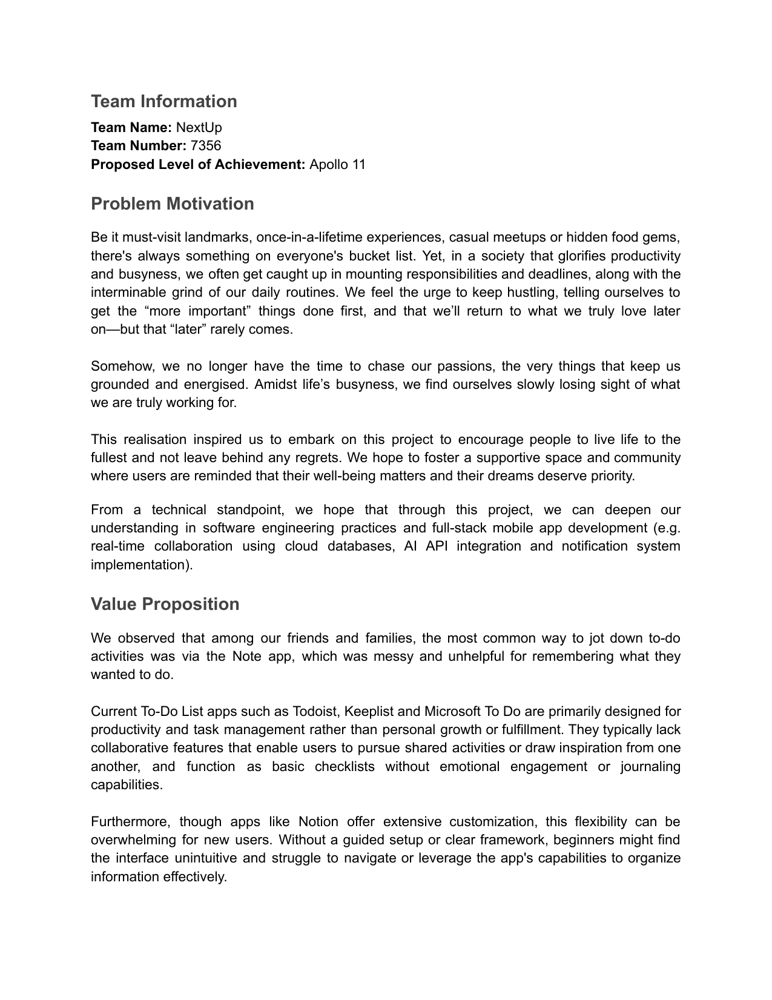

Users who have not previously created an account can click on the 'Sign up' text to navigate to the Sign-up page.

On the Sign-up page, there are three input fields—email, username and password. Users can only register with a unique email and username (not case-sensitive). Any input in the username field will be checked for its availability in real-time; available handles will be validated with a tick icon, while unavailable ones will trigger an inline feedback message.

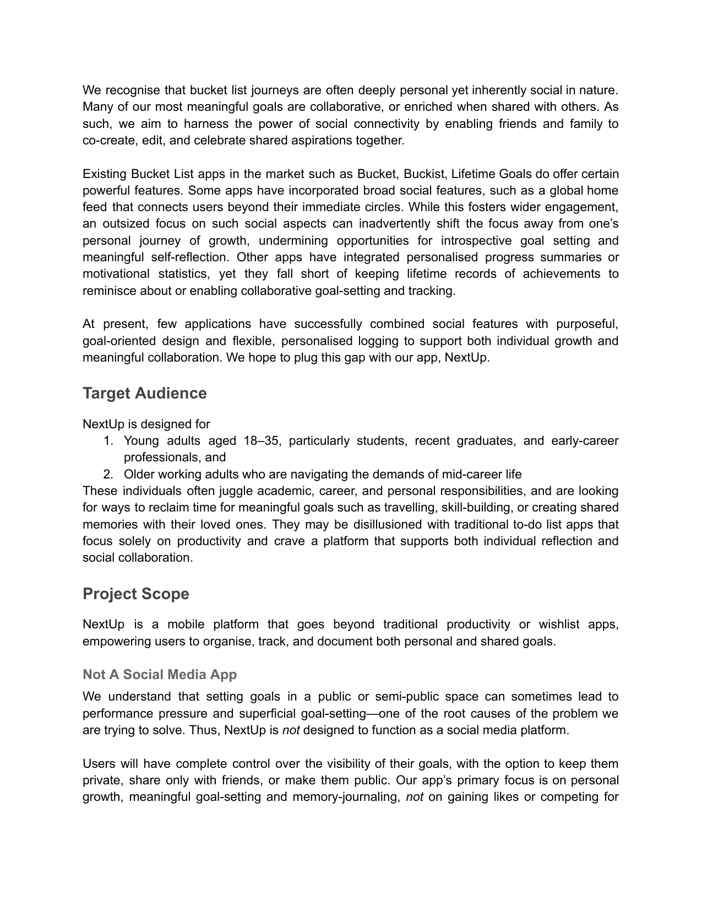

Passwords must be at least 6 characters and include at least:
- 1 uppercase letter
- 1 lowercase letter
- 1 number
- 1 special character (e.g. !@#$%)

The default sign-in option requires every field to be filled, otherwise the user will receive inline error message(s).

On successful sign-up, a flash message will be displayed to prompt users to check their inbox and verify their registered emails before logging in.

Users who attempt to log in without verifying their emails will receive a warning message and be denied access. The warning message includes a 'Resend Verification Email' button, which, when clicked, closes the warning and shows a success message once the email is re-sent. This allows users to complete the onboarding process even if the initial verification link expires after 3 days.

Registered users who have forgotten their password or wish to reset their password can click on the 'Forgot Password?' text on the Login page. They will then be directed to the Forgot Password page, where they can enter their registered email. Upon submission, a password reset link will be sent to their email. Users can then click on this link to navigate to a password reset page where they can enter a new password that meets the same password requirements as the sign-up page.

#### Challenges Faced

1. **Email Verification Integration:** Integrating email verification with Firebase Authentication required careful handling of verification links and token expiration. We had to implement a resend mechanism to handle cases where users did not receive the initial verification email or the link expired.

2. **Real-time Username Availability Check:** Implementing real-time username availability validation required querying the Firestore database on every keystroke, which could lead to performance issues. We optimized this by implementing debouncing to reduce the number of database queries.

3. **Password Reset Flow:** Implementing a secure password reset flow required careful handling of reset tokens and their expiration. We had to ensure that reset links were secure and could only be used once.

4. **Error Handling:** Providing clear and helpful error messages for various authentication scenarios (e.g., incorrect password, user not found, email already registered) required careful consideration of user experience.

#### Possible Add-Ons

- Two-factor authentication (2FA) for enhanced security
- Social login options (Google, Facebook, Apple)
- Biometric authentication (fingerprint, face recognition)
- Single Sign-On (SSO) integration for enterprise users

---

### 2. Creating and Updating Sub-Bucket Lists

#### Deliverables

Users can create new bucket lists by clicking the 'Create New Bucket List' button on the home page. They will be directed to a creation page where they can:

- Enter a title for the bucket list
- Set the access status:
  - Private (only the user can see)
  - Shared with friends (selected friends can see and edit)
  - Public (any user can see)
- Invite friends to collaborate/edit the sublist
- Add/delete events from the sublist
  - For each event: Add tags to categorise

Users can view all their bucket lists on the home page. Each bucket list card displays:
- The title of the bucket list
- The number of events completed vs. total events
- The access status (private, shared, or public)
- A progress bar showing completion percentage

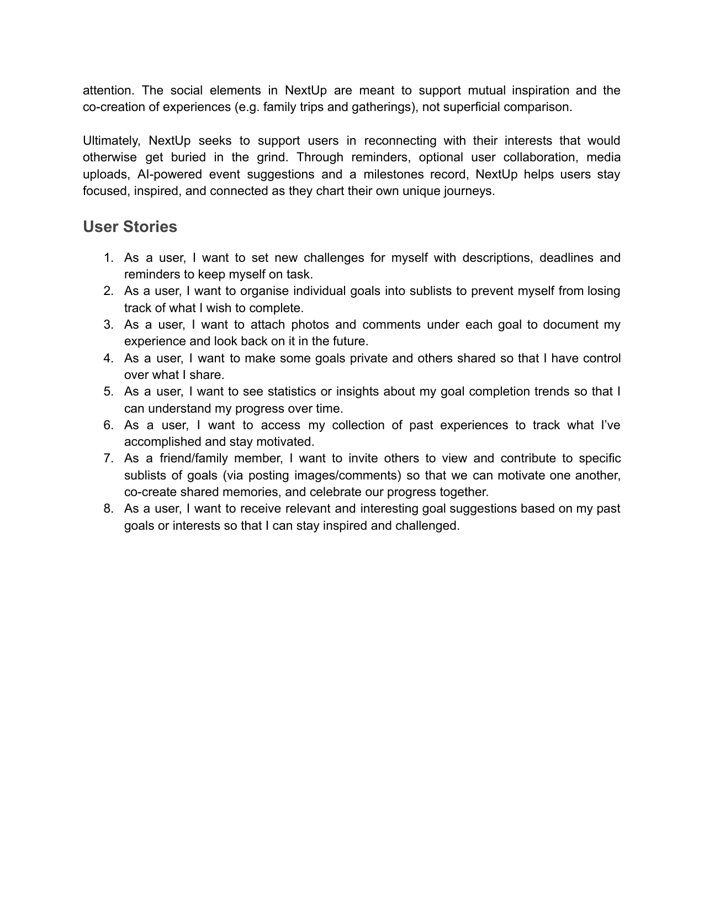

Users can click on a bucket list to view all events within that list. On the sublist page, users can:
- View all events in the bucket list
- Add new events to the list
- Edit existing events
- Delete events from the list
- Mark events as completed
- View event details (description, deadline, tags, attachments)

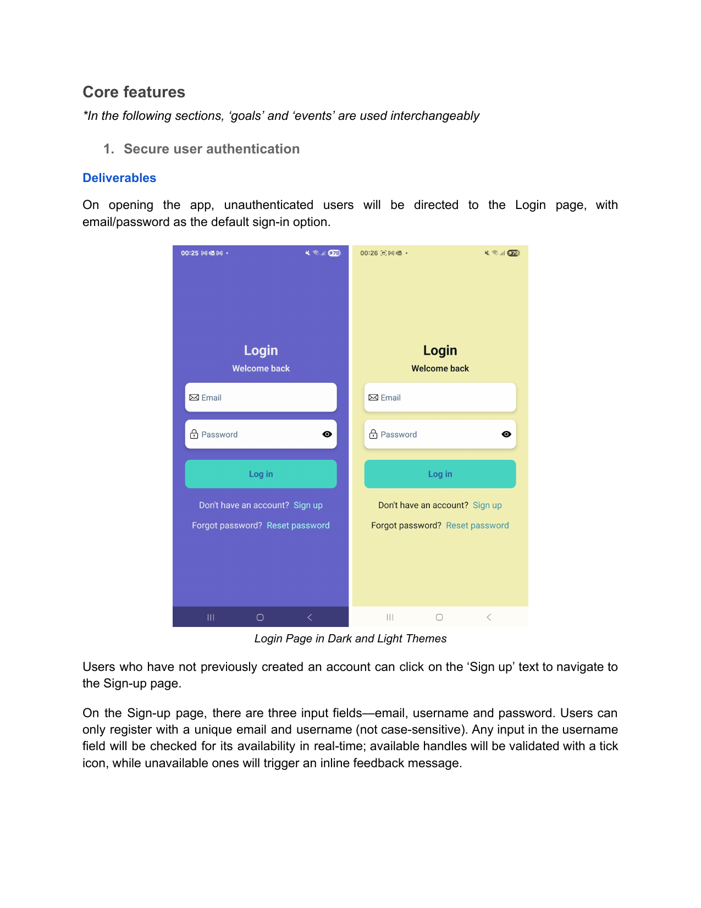

#### Design Considerations

1. **Hierarchical Structure:** The app uses a two-level hierarchy: bucket lists (top level) and events (sublevel). This structure is intuitive and prevents users from losing track of their goals.

2. **Visual Feedback:** Progress bars and completion counters provide visual feedback on the user's progress, motivating them to complete more events.

3. **Accessibility:** The UI is designed to be accessible to users with different abilities. Font sizes are adjustable, and color contrasts meet WCAG standards.

4. **Responsive Design:** The app is designed to work seamlessly on devices of different screen sizes, from small phones to tablets.

#### Challenges Faced

1. **Data Consistency:** Ensuring data consistency when users create, update, or delete bucket lists and events across multiple devices required implementing proper synchronization mechanisms.

2. **Performance Optimization:** Fetching and displaying large numbers of bucket lists and events efficiently required implementing pagination and lazy loading.

3. **Conflict Resolution:** When multiple users are editing the same shared bucket list concurrently, conflicts can arise. We implemented a last-write-wins strategy with conflict resolution mechanisms.

4. **Storage Optimization:** Managing storage efficiently, especially when users have many bucket lists and events, required implementing data archiving and cleanup mechanisms.

#### Challenges Faced

1. **Real-time Synchronization:** Ensuring that changes made by one user are immediately reflected on other users' devices required implementing real-time synchronization using WebSockets or similar technologies.

2. **Offline Support:** Allowing users to work offline and syncing changes when they come back online required implementing local caching and conflict resolution mechanisms.

3. **User Permissions:** Managing user permissions for shared bucket lists required implementing a robust permission system that could handle different access levels (view-only, edit, admin).

#### Future Plans

- Implement advanced filtering and sorting options for bucket lists and events
- Add support for recurring events
- Implement event templates for common types of goals
- Add integration with calendar applications (Google Calendar, Apple Calendar)
- Implement event reminders and notifications

---

### 3. Adding of Friends

#### Deliverables

Users can add friends by clicking the 'Add Friends' button on the app. They will be directed to the 'Add Friends' page where they can:

- Search for other users by username or email
- View user profiles
- Send friend requests

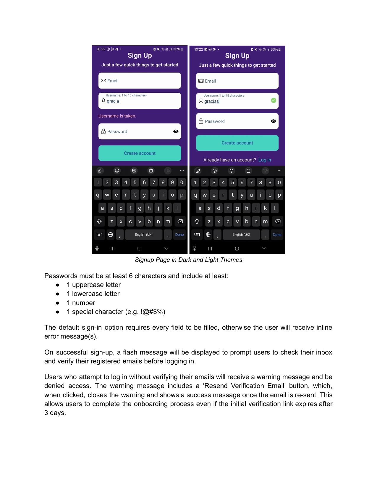

Users can view all their friends on the 'Friends' page. Each friend card displays:
- The friend's profile picture
- The friend's username
- The friend's status (online/offline)
- An option to remove the friend

Friends can accept or reject friend requests. When a friend request is received, users will see a notification and can view the request on the 'Friend Requests' page.

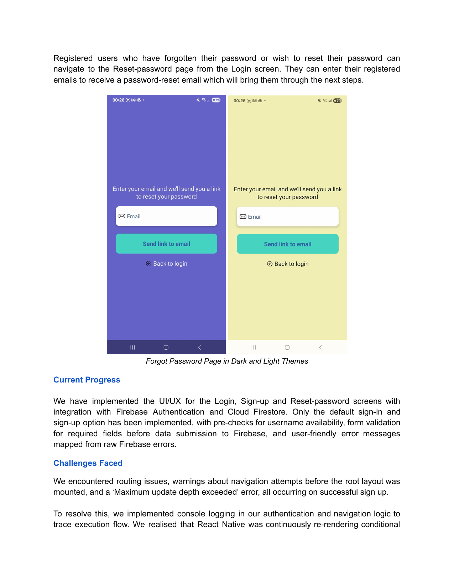

---

### 4. User Collaboration

#### Deliverables

Users can invite friends to collaborate on shared bucket lists. When creating or editing a bucket list, users can:

- Select the 'Shared with friends' access status
- Search for and select friends to invite
- Set permission levels for each friend (view-only, edit, admin)

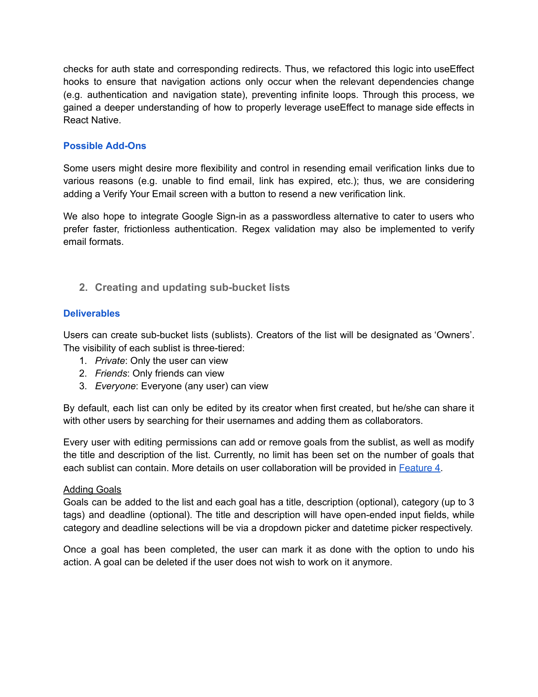

Invited friends will receive a notification and can accept or reject the invitation. Once accepted, they can view and edit the shared bucket list.

On shared bucket lists, collaborators can:
- Add new events to the list
- Edit existing events
- Delete events from the list
- Add comments and photos to events
- View activity logs showing who made what changes and when

#### Challenges Faced

1. **Real-time Synchronization:** Ensuring that changes made by one collaborator are immediately reflected on other collaborators' devices required implementing real-time synchronization mechanisms.

2. **Conflict Resolution:** When multiple collaborators edit the same event concurrently, conflicts can arise. We implemented a conflict resolution strategy that prioritizes the most recent change.

3. **Permission Management:** Managing different permission levels for different collaborators required implementing a robust permission system.

#### Possible Add-Ons

- Implement version history for bucket lists and events
- Add support for commenting and discussion threads on events
- Implement activity feeds showing all changes made to shared bucket lists
- Add support for collaborative editing with real-time cursor positions

---

### 5. Event Journaling

#### Deliverables

Users can document their experiences by attaching photos and comments to events. When viewing an event, users can:

- Upload photos from their device or take new photos
- Add comments and notes
- View timestamps of when the event was completed
- View all photos and comments attached to the event

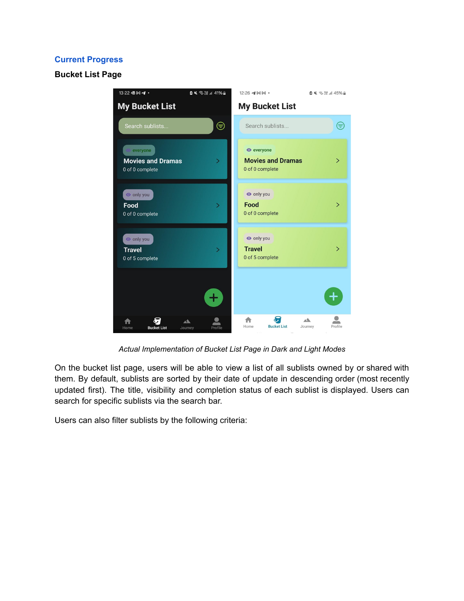

Photos are stored in a cloud storage service (Cloudinary) and can be accessed from any device. Comments are stored in the Firestore database and are synchronized in real-time across all devices.

#### Current Progress

- Photo upload functionality has been implemented and tested
- Comment system has been implemented and integrated with Firestore
- Real-time synchronization of photos and comments has been implemented
- UI for viewing and managing photos and comments has been designed and implemented

#### Challenges Faced

1. **Photo Storage and Retrieval:** Managing large photo files efficiently required implementing compression and optimization techniques. We used Cloudinary to handle photo storage and optimization.

2. **Real-time Synchronization:** Ensuring that photos and comments are synchronized in real-time across all devices required implementing WebSocket connections and real-time database listeners.

3. **Offline Support:** Allowing users to upload photos and add comments offline and syncing them when they come back online required implementing local caching and queuing mechanisms.

#### Possible Add-Ons

- Support for video uploads and playback
- Support for audio recordings and playback
- Automatic photo organization by date and location
- Integration with photo editing tools
- Support for photo albums and galleries

---

### 6. Milestones Record

#### Deliverables

Users can view their achievements and milestones on the 'Milestones' page. This page displays:

- All completed events organized by bucket list
- Dates when events were completed
- Photos and comments attached to completed events
- Statistics on completion rates and trends

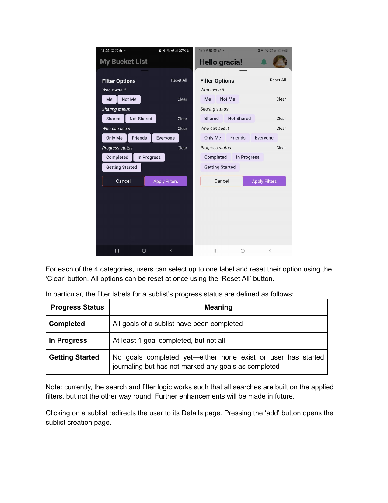

Users can click on a milestone to view more details, including:
- The event description and deadline
- All photos and comments attached to the event
- The date when the event was completed
- Any tags or categories associated with the event

---

### 7. Customisable Profile

#### Deliverables

Users can customize their profile by clicking on their profile picture or username. On the profile page, users can:

- Upload or change their profile picture
- Edit their username (subject to availability)
- Edit their bio/description
- Change their password
- Set privacy settings for their profile and bucket lists
- View their statistics (number of bucket lists, completed events, etc.)

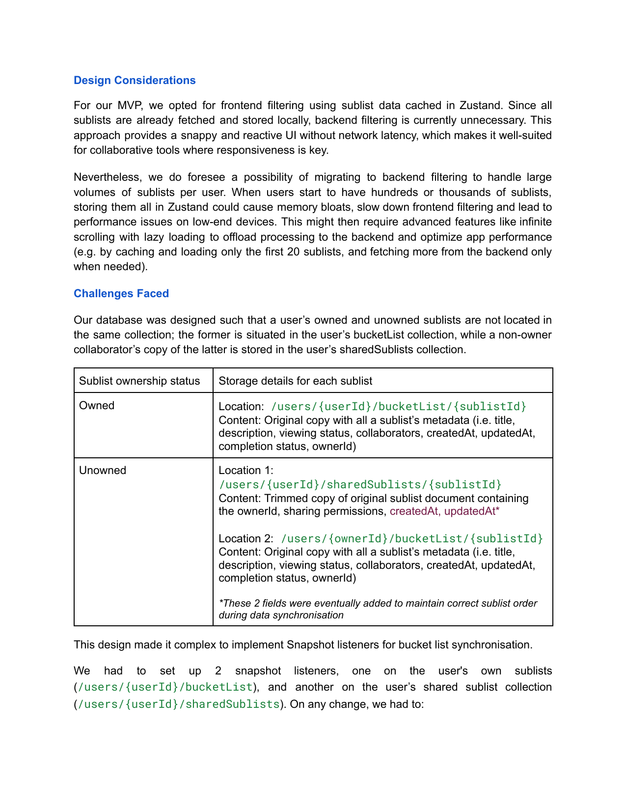

Users can also view other users' profiles by clicking on their profile picture or username. On other users' profiles, they can:
- View the user's profile picture and bio
- View the user's public bucket lists and events
- Send a friend request
- View the user's statistics (if public)

---

### 8. Display of User Progress

#### Deliverables

Users can view their progress statistics on the 'Progress' page. This page displays:

- Overall completion rate (percentage of events completed)
- Number of events completed vs. total events
- Completion trends over time (displayed as a line chart)
- Breakdown of completed events by bucket list (displayed as a pie chart)
- Breakdown of completed events by category/tag (displayed as a bar chart)

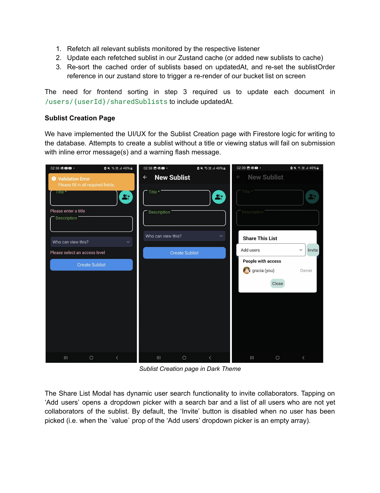

Users can filter the statistics by date range, bucket list, or category/tag to get more detailed insights.

#### Challenges Faced

1. **Data Aggregation:** Aggregating completion data across multiple bucket lists and events required implementing efficient database queries and caching mechanisms.

2. **Chart Rendering:** Rendering charts efficiently, especially for large datasets, required using a charting library (Chart.js) and implementing pagination.

3. **Real-time Updates:** Ensuring that progress statistics are updated in real-time as users complete events required implementing real-time database listeners and efficient state management.

---

### 9. Notifications

#### Deliverables

Users receive notifications for:

- Friend requests from other users
- Invitations to collaborate on shared bucket lists
- Reminders for upcoming event deadlines
- Notifications when friends complete events on shared bucket lists
- Notifications when friends add comments or photos to shared events

Notifications are displayed as:
- In-app notifications (banner at the top of the screen)
- Push notifications (on the user's device)
- Email notifications (optional)

Users can customize their notification preferences by:
- Enabling/disabling specific types of notifications
- Setting quiet hours (time periods when notifications are not sent)
- Choosing notification delivery methods (in-app, push, email)

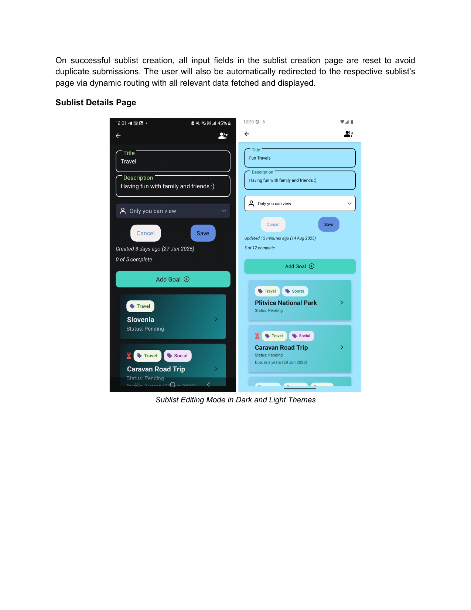

#### Possible Add-Ons

- SMS notifications for important events
- Notification scheduling (send notifications at specific times)
- Notification templates for different types of events
- Integration with third-party notification services

---

### 10. AI-Powered Event Suggestions

#### Deliverables

Users receive personalized event suggestions based on their past goals and interests. The suggestions are generated using the Gemini API, which analyzes:

- The user's completed events
- The user's bucket list categories and tags
- The user's interests and preferences
- Global trends and popular events

Suggestions are displayed on the home page and can be:
- Dismissed (not interested)
- Added to an existing bucket list
- Added to a new bucket list
- Saved for later review

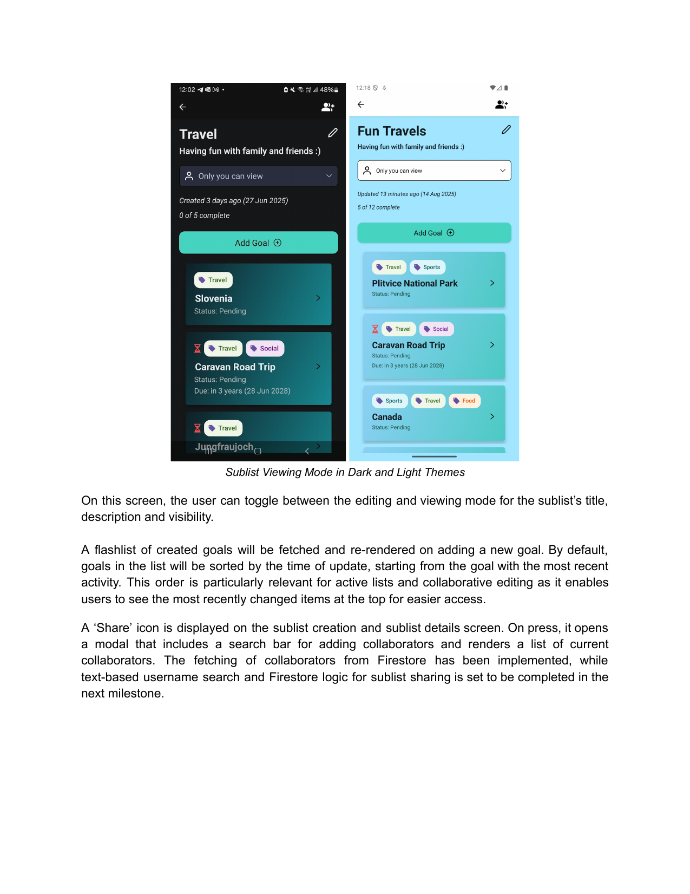

#### Possible Add-Ons

- Personalization based on location and local events
- Integration with external event databases (Eventbrite, Meetup, etc.)
- Machine learning model refinement based on user feedback
- Collaborative filtering to suggest events based on similar users' interests

---

## Application Design

### Technology Stack

The application is built using the following technologies:

**Frontend:**
- React Native with Expo for cross-platform mobile development
- TypeScript for type safety
- Redux or Zustand for state management
- React Navigation for navigation
- Figma for UI/UX design

**Backend:**
- Express.js for API server
- Node.js runtime
- Firebase Admin SDK for backend operations

**Database:**
- Cloud Firestore for real-time database
- Firebase Storage for file storage
- Cloudinary for image optimization and storage

**Authentication:**
- Firebase Authentication for user authentication
- JWT tokens for API authentication

**Real-time Features:**
- Firebase Realtime Database listeners for real-time updates
- WebSockets for real-time collaboration (future enhancement)

**AI Integration:**
- Gemini API for event suggestions

**Notifications:**
- Firebase Cloud Messaging (FCM) for push notifications
- Nodemailer for email notifications

**Development Tools:**
- Git for version control
- GitHub for code repository
- Figma for design collaboration
- Postman for API testing
- Jest for unit testing
- Expo for development and testing

### Frontend-to-Backend Authentication and High-Level Flow

#### Authentication & API Design

The authentication system follows these steps:

1. **User Registration:** User enters email, username, and password on the Sign-up page. The frontend sends a POST request to `/auth/signup` with the user's credentials.

2. **Backend Validation:** The backend validates the input (email format, password strength, username uniqueness) and creates a new user in Firebase Authentication.

3. **Email Verification:** Firebase sends a verification email to the user's email address. The user clicks the verification link in the email to verify their email.

4. **User Login:** User enters email and password on the Login page. The frontend sends a POST request to `/auth/login` with the user's credentials.

5. **Token Generation:** Upon successful authentication, Firebase returns an ID token. The frontend stores this token in secure storage (AsyncStorage on React Native).

6. **API Requests:** For subsequent API requests, the frontend includes the ID token in the Authorization header. The backend verifies the token using Firebase Admin SDK before processing the request.

7. **Token Refresh:** When the token expires, the frontend automatically refreshes it using the refresh token.

#### Request Flow

```
Client (Frontend)
    |
    | POST /auth/login
    | { email, password }
    |
    v
Server (Backend)
    |
    | Verify credentials with Firebase
    | Generate JWT token
    |
    v
Client (Frontend)
    |
    | Store token in secure storage
    |
    v
Client (Frontend)
    |
    | GET /api/bucketlists
    | Authorization: Bearer {token}
    |
    v
Server (Backend)
    |
    | Verify token
    | Fetch user's bucket lists from Firestore
    |
    v
Client (Frontend)
    |
    | Display bucket lists
    |
    v
```

---

### Zustand State Management

The application uses Zustand for state management. Zustand is a lightweight state management library that provides a simple and intuitive API for managing application state.

**State Structure:**

```javascript
const useStore = create((set) => ({
  // User state
  user: null,
  setUser: (user) => set({ user }),

  // Bucket lists state
  bucketLists: [],
  setBucketLists: (bucketLists) => set({ bucketLists }),

  // Events state
  events: [],
  setEvents: (events) => set({ events }),

  // Friends state
  friends: [],
  setFriends: (friends) => set({ friends }),

  // UI state
  isLoading: false,
  setIsLoading: (isLoading) => set({ isLoading }),

  // Notifications state
  notifications: [],
  addNotification: (notification) => set((state) => ({
    notifications: [...state.notifications, notification],
  })),
}));
```

**Usage:**

Components can access and update state using the `useStore` hook:

```javascript
const MyComponent = () => {
  const { bucketLists, setBucketLists } = useStore();

  return (
    <View>
      {bucketLists.map((list) => (
        <Text key={list.id}>{list.title}</Text>
      ))}
    </View>
  );
};
```

---

### Real-time Data Flow

The application uses Firebase Realtime Database listeners to synchronize data in real-time across all devices.

**Real-time Synchronization:**

1. **User Opens App:** When the user opens the app, the frontend establishes a connection to Firestore.

2. **Listeners Attached:** The frontend attaches listeners to the user's bucket lists, events, and friends collections.

3. **Data Changes:** When data changes on the backend (e.g., another user adds an event to a shared bucket list), Firestore sends an update to all connected clients.

4. **State Updated:** The frontend receives the update and updates the Zustand state, triggering a re-render of affected components.

5. **UI Updated:** The UI is updated to reflect the changes.

**Example:**

```javascript
useEffect(() => {
  const unsubscribe = db.collection('bucketLists')
    .where('userId', '==', user.uid)
    .onSnapshot((snapshot) => {
      const bucketLists = snapshot.docs.map((doc) => ({
        id: doc.id,
        ...doc.data(),
      }));
      setBucketLists(bucketLists);
    });

  return () => unsubscribe();
}, [user.uid]);
```

---

### Software Engineering Practices

The project follows industry best practices for software development:

**Version Control:**
- Git for version control
- Feature branch workflow for development
- Pull requests for code review
- Commit messages following conventional commits

**Code Quality:**
- ESLint for code linting
- Prettier for code formatting
- TypeScript for type safety
- Code reviews before merging

**Testing:**
- Unit tests for individual functions and components
- Integration tests for API endpoints and database operations
- End-to-end tests for user workflows
- Jest for testing framework
- React Testing Library for component testing

**Documentation:**
- README.md for project overview
- API documentation using Swagger/OpenAPI
- Code comments for complex logic
- Figma for design documentation

**CI/CD:**
- GitHub Actions for automated testing and deployment
- Automated tests run on every pull request
- Automated deployment to staging environment
- Manual approval for production deployment

**Performance Optimization:**
- Lazy loading for large lists
- Pagination for data fetching
- Image optimization using Cloudinary
- Caching for frequently accessed data
- Database query optimization

---

## Testing

### Backend

**API Testing:**
- Postman for manual API testing
- Jest for automated API testing
- Test coverage for all endpoints

**Database Testing:**
- Firestore emulator for local testing
- Test data setup and teardown
- Query optimization testing

**Authentication Testing:**
- Firebase Authentication emulator for local testing
- Token validation testing
- Password reset flow testing

### API Testing

**Endpoint Testing:**

1. **User Authentication Endpoints:**
   - POST /auth/signup - User registration
   - POST /auth/login - User login
   - POST /auth/logout - User logout
   - POST /auth/forgot-password - Password reset request
   - POST /auth/reset-password - Password reset

2. **Bucket List Endpoints:**
   - GET /api/bucketlists - Fetch user's bucket lists
   - POST /api/bucketlists - Create new bucket list
   - PUT /api/bucketlists/:id - Update bucket list
   - DELETE /api/bucketlists/:id - Delete bucket list

3. **Event Endpoints:**
   - GET /api/bucketlists/:id/events - Fetch events in bucket list
   - POST /api/bucketlists/:id/events - Add event to bucket list
   - PUT /api/bucketlists/:id/events/:eventId - Update event
   - DELETE /api/bucketlists/:id/events/:eventId - Delete event

4. **Friend Endpoints:**
   - GET /api/friends - Fetch user's friends
   - POST /api/friends/requests - Send friend request
   - PUT /api/friends/requests/:id - Accept/reject friend request
   - DELETE /api/friends/:id - Remove friend

5. **Collaboration Endpoints:**
   - POST /api/bucketlists/:id/invite - Invite collaborator
   - PUT /api/bucketlists/:id/permissions/:userId - Update permissions
   - DELETE /api/bucketlists/:id/collaborators/:userId - Remove collaborator

**Test Cases:**

Each endpoint is tested with:
- Valid input (success case)
- Invalid input (error cases)
- Missing required fields
- Unauthorized access
- Permission checks

### Unit Testing

**Component Testing:**

Components are tested using React Testing Library:

```javascript
describe('BucketListCard', () => {
  it('renders bucket list title', () => {
    const bucketList = { id: '1', title: 'Travel' };
    const { getByText } = render(<BucketListCard bucketList={bucketList} />);
    expect(getByText('Travel')).toBeInTheDocument();
  });

  it('displays completion percentage', () => {
    const bucketList = { id: '1', title: 'Travel', completed: 5, total: 10 };
    const { getByText } = render(<BucketListCard bucketList={bucketList} />);
    expect(getByText('50%')).toBeInTheDocument();
  });
});
```

**State Management Testing:**

Zustand state is tested using Jest:

```javascript
describe('useStore', () => {
  it('updates bucket lists', () => {
    const { result } = renderHook(() => useStore());
    const bucketLists = [{ id: '1', title: 'Travel' }];
    act(() => {
      result.current.setBucketLists(bucketLists);
    });
    expect(result.current.bucketLists).toEqual(bucketLists);
  });
});
```

**Utility Function Testing:**

Utility functions are tested using Jest:

```javascript
describe('calculateCompletionPercentage', () => {
  it('returns 0 for no completed events', () => {
    expect(calculateCompletionPercentage(0, 10)).toBe(0);
  });

  it('returns 50 for 5 out of 10 completed', () => {
    expect(calculateCompletionPercentage(5, 10)).toBe(50);
  });

  it('returns 100 for all completed', () => {
    expect(calculateCompletionPercentage(10, 10)).toBe(100);
  });
});
```

### User Testing

**Usability Testing:**

1. **Task Completion:** Users are asked to complete specific tasks (e.g., create a bucket list, add an event, invite a friend) and their success rate is measured.

2. **Time to Completion:** The time taken to complete tasks is measured to identify areas where the UI can be simplified.

3. **Error Recovery:** Users are observed to see how they recover from errors (e.g., entering an invalid email).

4. **Navigation:** Users are observed to see if they can easily navigate between different screens.

5. **Feedback Collection:** Users are asked for feedback on specific aspects of the app (e.g., design, functionality, ease of use).

**A/B Testing:**

Different versions of the UI are tested with different user groups to identify the most effective design.

**Feedback Collection:**

Users are asked to provide feedback through:
- In-app feedback form
- Email surveys
- User interviews
- App store reviews

---

## Timeline and Development Plan

| MS | Tasks | Description | In Charge | Date |
|---|---|---|---|---|
| 1 | Finalise Ideas | Discuss project structure, features and tech stack | Gracia, Tricia | 12 May |
| | Set up project structure | Set up project structure and clean up newly created Expo app | Tricia | 12 May |
| | Draft wireframes | Draft wireframes and designed UI/UX for Home, Journey Bucket List Sublist, Completed Event, Event Update, and Profile screens using Figma | Gracia, Tricia | 12 May |
| 13 | Learning and Research | Pick up technical knowledge on React Native (Expo), Firebase and Github | Gracia, Tricia | 12 May - 17 May |
| | User account authentication and main login screens | Set up Firebase and implement user authentication for email and password | Tricia | 12 May - 21 May |
| | | Implement sign-up/login/forgot-password screen UI | Gracia | 21 May |
| | | Integrate processes with firebase backend | | 23 May - 25 May |
| 27 | | Implement home page UI with logout | Tricia | 23 May |
| | | Implement bucket list page UI | Gracia | 16 May |
| | | Implement journey page UI | Tricia | |
| | | Implement profile page UI | Tricia | |
| | | Implement new-sublist page UI | Gracia | 29 May |
| | | Connect project to Cloud Firestore | Tricia | 25 May |
| | Evaluation Milestone 1 | Ideation, Proof-of-concept | | 2 June |
| 2 | Social feature: adding friends | Implement UI of friends and add friends page | Tricia | 30 May - 31 May |
| | Profile screen enhancement | Implement UI for edit profile modal | Tricia | 15 June - 24 June |
| | Screens integration with database | Display dynamic user data for home, bucketlist, journey, profile, friends and add friends screens | Gracia, Tricia | |
| | Create bucket list feature | Bucket list (sublist) creation page with: Add title, Set access status (private/shared/public), Invite friends to collaborate/edit sublist, Add/delete events from sublist, Add tags to categorise, Ensure user data can be written to and retrieved from Cloud Firestore | Gracia | |
| | Express JS backend | Set up Firebase Admin and Cloudinary | Gracia, Tricia | 16 June - 22 June |
| | Testing and debugging | Refine UI/UX, review CRUD operations, test code for bugs, resolve known issues | Gracia, Tricia | 24 June - 28 June |
| | Evaluation Milestone 2 | Implement system prototype containing the most essential features, Perform system testing | Tricia | 30 June |
| 3 | Social feature: Enhancing add friends | Sending an invite, Friends can accept or reject invites, Friends added can be removed | Tricia | 1 July - 3 July |
| | Notifications | Displaying notifications for friend requests and invitations to sub-bucket lists | Tricia | 1 July - 4 July |
| | Customisation feature | Upload profile picture | Tricia | 5 July - 6 July |
| | AI suggestion feature | Gemini API integration, suggestions UI | Gracia | 1 July - 3 July |
| | Adding reflections and event journaling | Event journaling feature set up | | |
| | Inviting collaborators for shared sublists | Add and integrate Firestore sublist sharing logic and REST api: Invite collaborators, Create/fetch/update shared sublists as collaborators, Create/fetch/update/delete goals as collaborators | Gracia | 1 July - 4 July |
| | Filter feature | Search filter set up | Gracia | 4 July - 6 July |
| | Testing and debugging | Refine UI/UX, test and review code, user testing and feedback | Gracia, Tricia | 9 July - 18 July |
| | Project work by 28 July | Milestone 3 (Extensions) - Extend system by adding more useful features, Perform system/user testing | | 28 July |
| 4 | Refinement | Continuously monitor AI integration performance and address any issues; conduct other necessary feature improvements | Gracia, Tricia | 29 July - 14 August |
| | Optimisation | Work on performance optimisation, e.g. optimize database reads/writes to reduce load time and Firestore costs, etc. | | |
| | Testing and debugging | Test and review code, user testing and feedback, review and finalise UI/UX | | |
| | Project work by 14 August | Final Submission (Refinement) - Polish up system and fix outstanding issues | | 14 August |

---

## Technical Proof-of-Concept

Open this link on your Android devices (or scan the QR code) to install the app:

https://expo.dev/accounts/gracias022/projects/nextup/builds/d4fd32ef-8c29-484c-89d0-a8fbda45a27a

You may use the following sign-in credentials:

**Email:** purplepiess03@gmail.com

**Password:** Purple123!

---

## Project Log

**Google Sheets:**

https://docs.google.com/spreadsheets/d/1c6MvHHeD54IcdIBhyTbzKOeJJeQ693PvFEcSDsSKT9Y/

**Poster:**

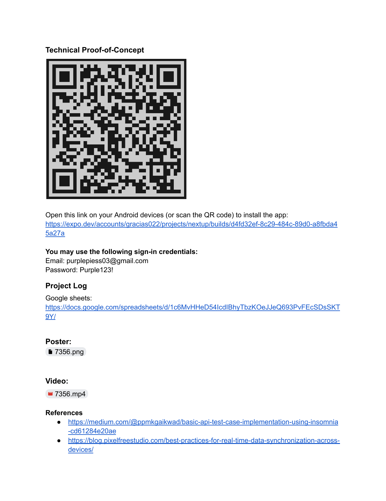

**Video:**

[Milestone 3 Video](./NextUp_README_assets/pdf_page-63.png)

---

## References

- https://medium.com/@ppmkgaikwad/basic-api-test-case-implementation-using-insomnia-cd61284e20ae
- https://blog.pixelfreestudio.com/best-practices-for-real-time-data-synchronization-across-devices/
- https://medium.com/@andrew.chester/react-native-infinite-scrolling-with-lazy-loading-a-step-by-step-guide-e91647348689
- https://zustand.docs.pmnd.rs/getting-started/introduction
- https://medium.com/@talhatlc/firestore-batches-vs-transactions-when-and-how-to-use-them-49a83e8a7c42

---

*This README was converted from the original PDF document for the NextUp Orbital 2025 project.*
