# **Orbital 2025 README**

## Table of Contents

- [Team Information](#team-information)
- [Problem Motivation](#problem-motivation)
- [Value Proposition](#value-proposition)
- [Target Audience](#target-audience)
- [Project Scope](#project-scope)
    - [Not A Social Media App](#not-a-social-media-app)
- [User Stories](#user-stories)
- [Core Features](#core-features)
    - [1. Secure user authentication](#1-secure-user-authentication)
    - [2. Creating and updating sub-bucket lists](#2-creating-and-updating-sub-bucket-lists)
    - [3. Adding of friends](#3-adding-of-friends)
    - [4. User collaboration](#4-user-collaboration)
    - [5. Event Journaling](#5-event-journaling)
    - [6. Milestones Record](#6-milestones-record)
    - [7. Customisable Profile](#7-customisable-profile)
    - [8. Display of User Progress](#8-display-of-user-progress)
    - [9. Notifications](#9-notifications)
    - [10. AI-powered Event Suggestions](#10-ai-powered-event-suggestions)
- [Application Design](#application-design)
    - [Technology Stack](#technology-stack)
    - [Frontend-to-Backend Authentication and High-Level Flow](#frontend-to-backend-authentication-and-high-level-flow)
        - [Authentication & API Design](#authentication--api-design)
            - [Request Flow](#request-flow)
        - [Zustand State Management](#zustand-state-management)
        - [Real-time Data Flow](#real-time-data-flow)
    - [Software Engineering Practices](#software-engineering-practices)
- [Testing](#testing)
    - [Backend](#backend)
        - [API Testing](#api-testing)
    - [Unit Testing](#unit-testing)
    - [User Testing](#user-testing)
- [Timeline and Development Plan](#timeline-and-development-plan)
- [Technical Proof-of-Concept](#technical-proof-of-concept)
- [Project Log](#project-log)
- [Poster](#poster)
- [Video](#video)

---

## Team Information

**Team Name:** NextUp

**Team Number:** 7356

**Proposed Level of Achievement:** Apollo 11

---

## Problem Motivation

Be it must-visit landmarks, once-in-a-lifetime experiences, casual meetups or hidden food gems, there's always something on everyone's bucket list. Yet, in a society that glorifies productivity and busyness, we often get caught up in mounting responsibilities and deadlines, along with the interminable grind of our daily routines. We feel the urge to keep hustling, telling ourselves to get the "more important" things done first, and that we'll return to what we truly love later on—but that "later" rarely comes.

Somehow, we no longer have the time to chase our passions, the very things that keep us grounded and energised. Amidst life's busyness, we find ourselves slowly losing sight of what we are truly working for.

This realisation inspired us to embark on this project to encourage people to live life to the fullest and not leave behind any regrets. We hope to foster a supportive space and community where users are reminded that their well-being matters and their dreams deserve priority.

From a technical standpoint, we hope that through this project, we can deepen our understanding in software engineering practices and full-stack mobile app development (e.g. real-time collaboration using cloud databases, AI API integration and notification system implementation).

---

## Value Proposition

We observed that among our friends and families, the most common way to jot down to-do activities was via the Note app, which was messy and unhelpful for remembering what they wanted to do.

Current To-Do List apps such as Todoist, Keeplist and Microsoft To Do are primarily designed for productivity and task management rather than personal growth or fulfillment. They typically lack collaborative features that enable users to pursue shared activities or draw inspiration from one another, and function as basic checklists without emotional engagement or journaling capabilities.

Furthermore, though apps like Notion offer extensive customization, this flexibility can be overwhelming for new users. Without a guided setup or clear framework, beginners might find the interface unintuitive and struggle to navigate or leverage the app's capabilities to organize information effectively.

We recognise that bucket list journeys are often deeply personal yet inherently social in nature. Many of our most meaningful goals are collaborative, or enriched when shared with others. As such, we aim to harness the power of social connectivity by enabling friends and family to co-create, edit, and celebrate shared aspirations together.

Existing Bucket List apps in the market such as Bucket, Buckist, Lifetime Goals do offer certain powerful features. Some apps have incorporated broad social features, such as a global home feed that connects users beyond their immediate circles. While this fosters wider engagement, an outsized focus on such social aspects can inadvertently shift the focus away from one's personal journey of growth, undermining opportunities for introspective goal setting and meaningful self-reflection. Other apps have integrated personalised progress summaries or motivational statistics, yet they fall short of keeping lifetime records of achievements to reminisce about or enabling collaborative goal-setting and tracking.

At present, few applications have successfully combined social features with purposeful, goal-oriented design and flexible, personalised logging to support both individual growth and meaningful collaboration. We hope to plug this gap with our app, NextUp.

---

## Target Audience

NextUp is designed for

1. Young adults aged 18–35, particularly students, recent graduates, and early-career professionals, and
2. Older working adults who are navigating the demands of mid-career life

These individuals often juggle academic, career, and personal responsibilities, and are looking for ways to reclaim time for meaningful goals such as travelling, skill-building, or creating shared memories with their loved ones. They may be disillusioned with traditional to-do list apps that focus solely on productivity and crave a platform that supports both individual reflection and social collaboration.

---

## Project Scope

NextUp is a mobile platform that goes beyond traditional productivity or wishlist apps, empowering users to organise, track, and document both personal and shared goals.

### Not A Social Media App

We understand that setting goals in a public or semi-public space can sometimes lead to performance pressure and superficial goal-setting—one of the root causes of the problem we are trying to solve. Thus, NextUp is not designed to function as a social media platform.

Users will have complete control over the visibility of their goals, with the option to keep them private, share only with friends, or make them public. Our app's primary focus is on personal growth, meaningful goal-setting and memory-journaling, _not_ on gaining likes or competing for attention. The social elements in NextUp are meant to support mutual inspiration and the co-creation of experiences (e.g. family trips and gatherings), not superficial comparison.

Ultimately, NextUp seeks to support users in reconnecting with their interests that would otherwise get buried in the grind. Through reminders, optional user collaboration, media uploads, AI-powered event suggestions and a milestones record, NextUp helps users stay focused, inspired, and connected as they chart their own unique journeys.

---

## User Stories

1. As a user, I want to set new challenges for myself with descriptions, deadlines and reminders to keep myself on task.

2. As a user, I want to organise individual goals into sublists to prevent myself from losing track of what I wish to complete.

3. As a user, I want to attach photos and comments under each goal to document my experience and look back on it in the future.

4. As a user, I want to make some goals private and others shared so that I have control over what I share.

5. As a user, I want to see statistics or insights about my goal completion trends so that I can understand my progress over time.

6. As a user, I want to access my collection of past experiences to track what I've accomplished and stay motivated.

7. As a friend/family member, I want to invite others to view and contribute to specific sublists of goals (via posting images/comments) so that we can motivate one another, co-create shared memories, and celebrate our progress together.

8. As a user, I want to receive relevant and interesting goal suggestions based on my past goals or interests so that I can stay inspired and challenged.

---

## Core Features

*In the following sections, 'goals' and 'events' are used interchangeably*

### 1. Secure User Authentication

#### Deliverables

On opening the app, unauthenticated users will be directed to the Login page, with email/password as the default sign-in option.

    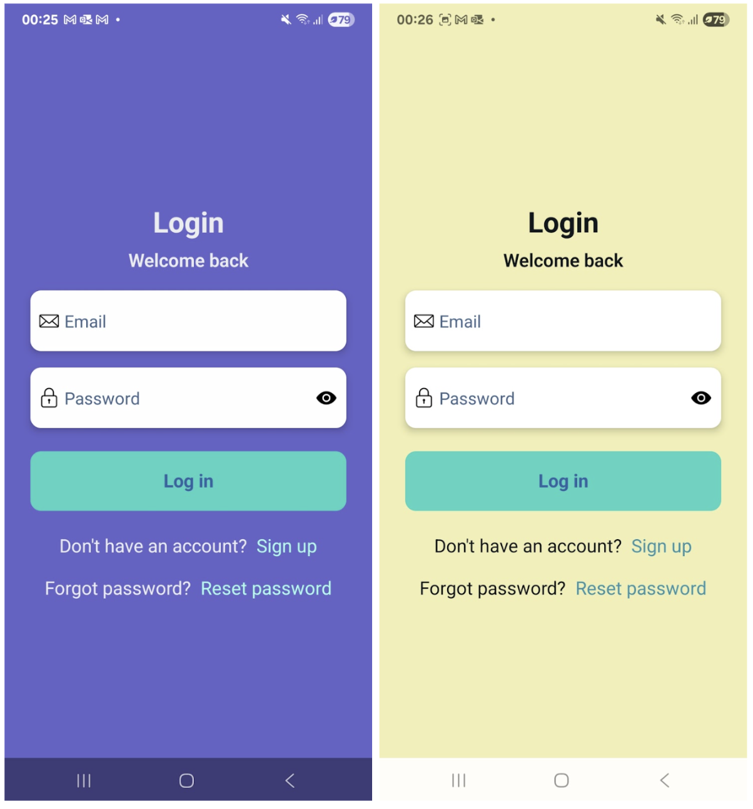
    
<em>Login Page in Dark and Light Themes</em>

Users who have not previously created an account can click on the 'Sign up' text to navigate to the Sign-up page.

On the Sign-up page, there are three input fields—email, username and password. Users can only register with a unique email and username (not case-sensitive). Any input in the username field will be checked for its availability in real-time; available handles will be validated with a tick icon, while unavailable ones will trigger an inline feedback message.

    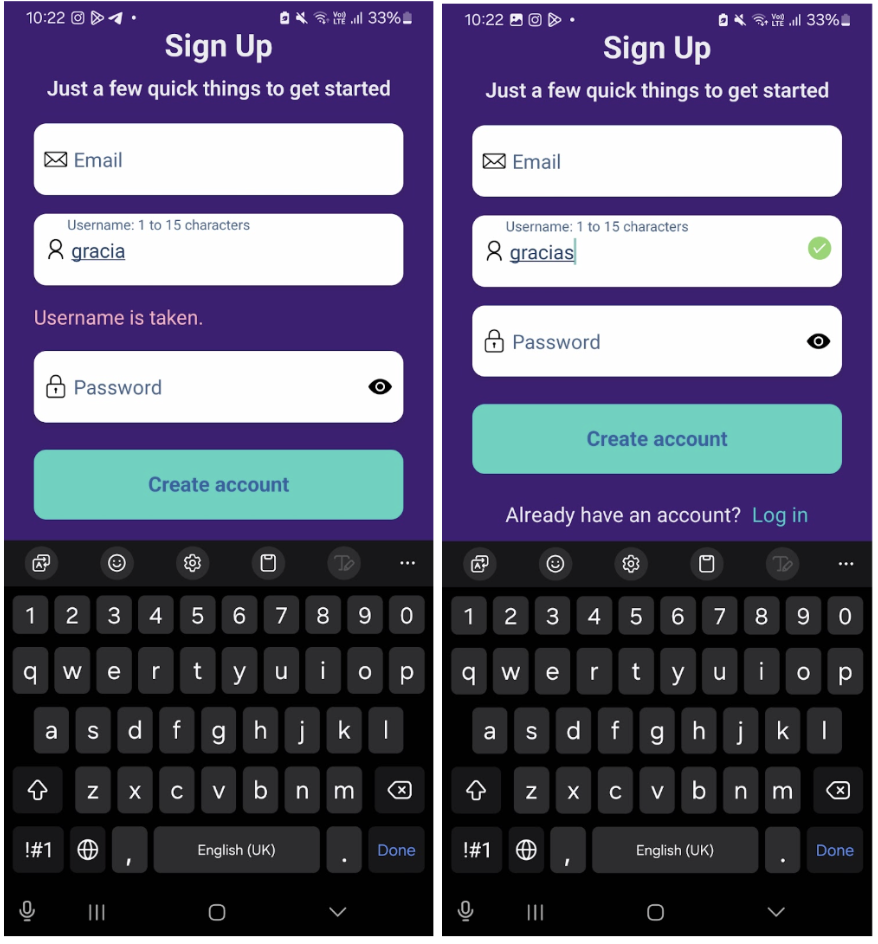
    
<em>Signup Page in Dark and Light Themes</em>

Passwords must be at least 6 characters and include at least:
- 1 uppercase letter
- 1 lowercase letter
- 1 number
- 1 special character (e.g. !@#$%)

The default sign-in option requires every field to be filled, otherwise the user will receive inline error message(s).

On successful sign-up, a flash message will be displayed to prompt users to check their inbox and verify their registered emails before logging in.

Users who attempt to log in without verifying their emails will receive a warning message and be denied access. The warning message includes a 'Resend Verification Email' button, which, when clicked, closes the warning and shows a success message once the email is re-sent. This allows users to complete the onboarding process even if the initial verification link expires after 3 days.

Registered users who have forgotten their password or wish to reset their password can navigate to the Reset-password page from the Login screen. They can enter their registered emails to receive a password-reset email which will bring them through the next steps.

    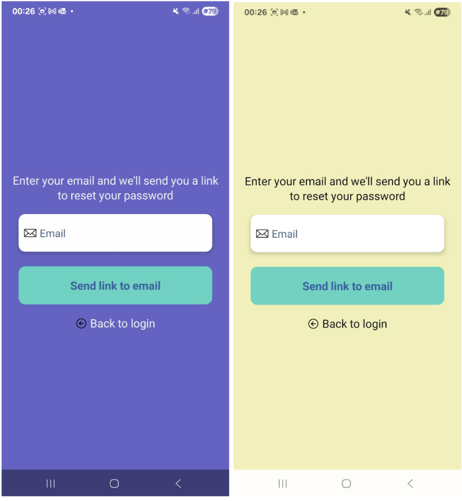
    
<em>Forgot Password Page in Dark and Light Themes</em>

#### Current Progress

We have implemented the UI/UX for the Login, Sign-up and Reset-password screens with integration with Firebase Authentication and Cloud Firestore. Only the default sign-in and sign-up option has been implemented, with pre-checks for username availability, form validation for required fields before data submission to Firebase, and user-friendly error messages mapped from raw Firebase errors. 

#### Challenges Faced

We encountered routing issues, warnings about navigation attempts before the root layout was mounted, and a ‘Maximum update depth exceeded’ error, all occurring on successful sign up. 

To resolve this, we implemented console logging in our authentication and navigation logic to trace execution flow. We realised that React Native was continuously re-rendering conditional checks for auth state and corresponding redirects. Thus, we refactored this logic into useEffect hooks to ensure that navigation actions only occur when the relevant dependencies change (e.g. authentication and navigation state), preventing infinite loops. Through this process, we gained a deeper understanding of how to properly leverage useEffect to manage side effects in React Native.

#### Possible Add-Ons

Some users might desire more flexibility and control in resending email verification links due to various reasons (e.g. unable to find email, link has expired, etc.); thus, we are considering adding a Verify Your Email screen with a button to resend a new verification link.

We also hope to integrate Google Sign-in as a passwordless alternative to cater to users who prefer faster, frictionless authentication. Regex validation may also be implemented to verify email formats.

### 2. Creating and Updating Sub-Bucket Lists

#### Deliverables

Users can create sub-bucket lists (sublists). Creators of the list will be designated as ‘Owners’. The visibility of each sublist is three-tiered: 

1. _Private_: Only the user can view 

2. _Friends_: Only friends can view

3. _Everyone_: Everyone (any user) can view

By default, each list can only be edited by its creator when first created, but he/she can share it with other users by searching for their usernames and adding them as collaborators. 

Every user with editing permissions can add or remove goals from the sublist, as well as modify the title and description of the list. Currently, no limit has been set on the number of goals that each sublist can contain. More details on user collaboration will be provided in [Feature 4](#4-user-collaboration).

Adding Goals

Goals can be added to the list and each goal has a title, description (optional), category (up to 3 tags) and deadline (optional). The title and description will have open-ended input fields, while category and deadline selections will be via a dropdown picker and datetime picker respectively.

Once a goal has been completed, the user can mark it as done with the option to undo his action. A goal can be deleted if the user does not wish to work on it anymore.

#### Current Progress
#### Bucket List Page

    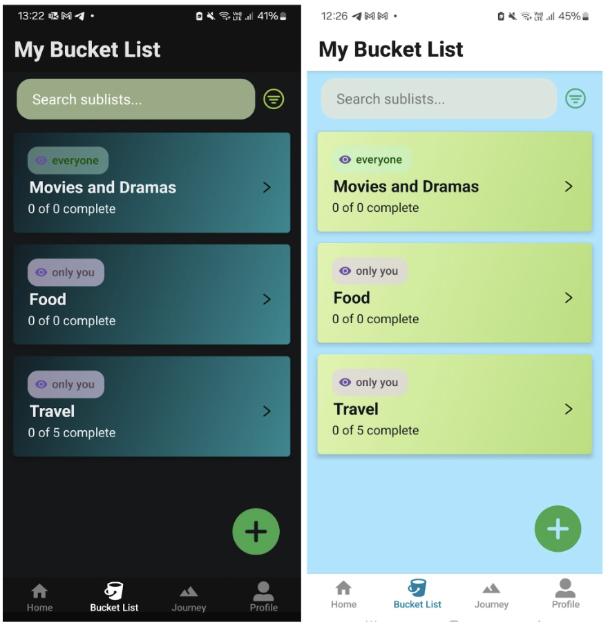
    
<em>Actual Implementation of Bucket List Page in Dark and Light Themes</em>

On the bucket list page, users will be able to view a list of all sublists owned by or shared with them. By default, sublists are sorted by their date of update in descending order (most recently updated first). The title, visibility and completion status of each sublist is displayed. Users can search for specific sublists via the search bar. 

Users can also filter sublists by the following criteria: 

    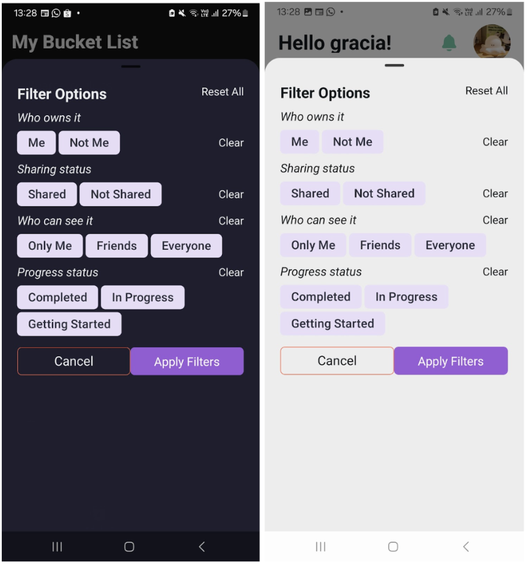

For each of the 4 categories, users can select up to one label and reset their option using the ‘Clear’ button. All options can be reset at once using the ‘Reset All’ button.

In particular, the filter labels for a sublist’s progress status are defined as follows:

|                     |                                                                                                                   |
| :-----------------: | :---------------------------------------------------------------------------------------------------------------: |
| **Progress Status** |                                                    **Meaning**                                                    |
|    **Completed**    |                                     All goals of a sublist have been completed                                    |
|   **In Progress**   |                                       At least 1 goal completed, but not all                                      |
| **Getting Started** | No goals completed yet—either none exist or user has started journaling but has not marked any goals as completed |

Note: currently, the search and filter logic works such that all searches are built on the applied filters, but not the other way round. Further enhancements will be made in future. 

Clicking on a sublist redirects the user to its Details page. Pressing the ‘add’ button opens the sublist creation page.

#### Design Considerations

For our MVP, we opted for frontend filtering using sublist data cached in Zustand. Since all sublists are already fetched and stored locally, backend filtering is currently unnecessary. This approach provides a snappy and reactive UI without network latency, which makes it well-suited for collaborative tools where responsiveness is key.
Nevertheless, we do foresee a possibility of migrating to backend filtering to handle large volumes of sublists per user. When users start to have hundreds or thousands of sublists, storing them all in Zustand could cause memory bloats, slow down frontend filtering and lead to performance issues on low-end devices. This might then require advanced features like infinite scrolling with lazy loading to offload processing to the backend and optimize app performance (e.g. by caching and loading only the first 20 sublists, and fetching more from the backend only when needed).

#### Challenges Faced

Our database was designed such that a user’s owned and unowned sublists are not located in the same collection; the former is situated in the user’s bucketList collection, while a non-owner collaborator’s copy of the latter is stored in the user’s sharedSublists collection. 

|                          |                                                                                                                                                                                                                                                                                                                                                                                                                                                                                                           |
| ------------------------ | --------------------------------------------------------------------------------------------------------------------------------------------------------------------------------------------------------------------------------------------------------------------------------------------------------------------------------------------------------------------------------------------------------------------------------------------------------------------------------------------------------- |
| Sublist ownership status | Storage details for each sublist                                                                                                                                                                                                                                                                                                                                                                                                                                                                          |
| Owned                    | Location:  `/users/{userId}/bucketList/{sublistId}`Content: Original copy with all a sublist’s metadata (i.e. title, description, viewing status, collaborators, createdAt, updatedAt, completion status, ownerId)                                                                                                                                                                                                                                                                                        |
| Unowned                  | Location 1: `/users/{userId}/sharedSublists/{sublistId}`Content: Trimmed copy of original sublist document containing the ownerId, sharing permissions, createdAt, updatedAt\*Location 2:` /users/{ownerId}/bucketList/{sublistId}`Content: Original copy with all a sublist’s metadata (i.e. title, description, viewing status, collaborators, createdAt, updatedAt, completion status, ownerId) _\*These 2 fields were eventually added to maintain correct sublist order during data synchronisation_ |

This design made it complex to implement Snapshot listeners for bucket list synchronisation.

We had to set up 2 snapshot listeners, one on the user's own sublists (`/users/{userId}/bucketList`), and another on the user’s shared sublist collection (`/users/{userId}/sharedSublists`). On any change, we had to:

1. Refetch all relevant sublists monitored by the respective listener

2. Update each refetched sublist in our Zustand cache (or added new sublists to cache)

3. Re-sort the cached order of sublists based on updatedAt, and re-set the sublistOrder reference in our zustand store to trigger a re-render of our bucket list on screen

The need for frontend sorting in step 3 required us to update each document in `/users/{userId}/sharedSublists` to include updatedAt. 

**Sublist Creation Page**

We have implemented the UI/UX for the Sublist Creation page with Firestore logic for writing to the database. Attempts to create a sublist without a title or viewing status will fail on submission with inline error message(s) and a warning flash message. 

    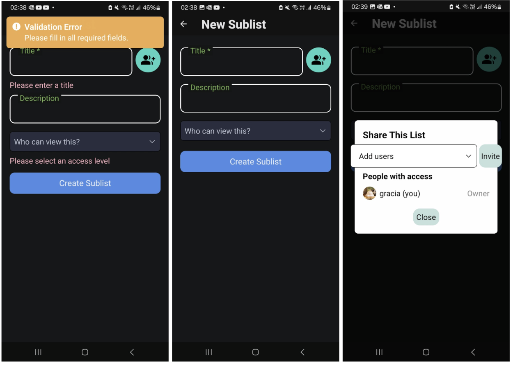
    
<em>Sublist Creation page in Dark Theme</em>

The Share List Modal has dynamic user search functionality to invite collaborators. Tapping on ‘Add users’ opens a dropdown picker with a search bar and a list of all users who are not yet collaborators of the sublist. By default, the ‘Invite’ button is disabled when no user has been picked (i.e. when the \`value\` prop of the ‘Add users’ dropdown picker is an empty array).

On successful sublist creation, all input fields in the sublist creation page are reset to avoid duplicate submissions. The user will also be automatically redirected to the respective sublist’s page via dynamic routing with all relevant data fetched and displayed. 

**Sublist Details Page**

    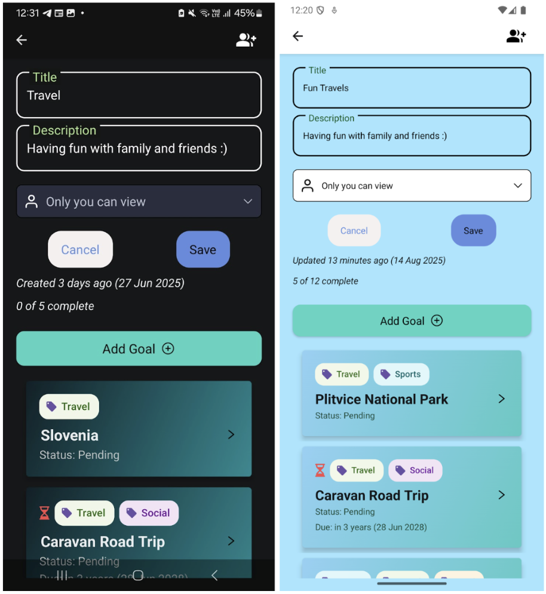
    
<em>Sublist Editing Mode in Dark and Light Themes</em>

    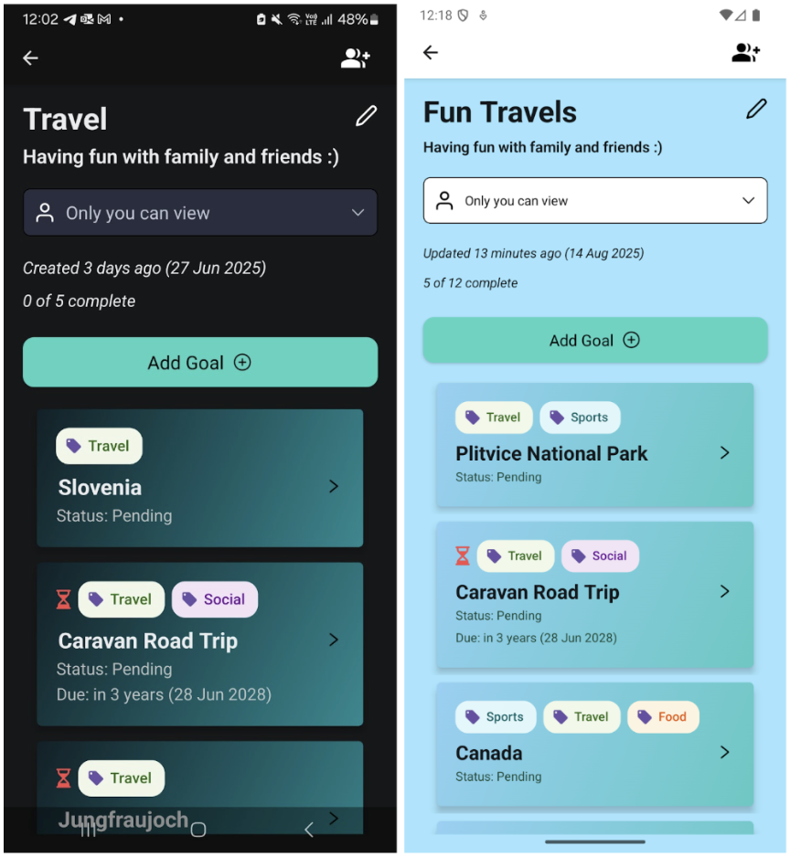
    
<em>Sublist Viewing Mode in Dark and Light Themes</em>

On this screen, the user can toggle between the editing and viewing mode for the sublist’s title, description and visibility. 

A flashlist of created goals will be fetched and re-rendered on adding a new goal. By default, goals in the list will be sorted by the time of update, starting from the goal with the most recent activity. This order is particularly relevant for active lists and collaborative editing as it enables users to see the most recently changed items at the top for easier access. 

A ‘Share’ icon is displayed on the sublist creation and sublist details screen. On press, it opens a modal that includes a search bar for adding collaborators and renders a list of current collaborators. The fetching of collaborators from Firestore has been implemented, while text-based username search and Firestore logic for sublist sharing is set to be completed in the next milestone.

    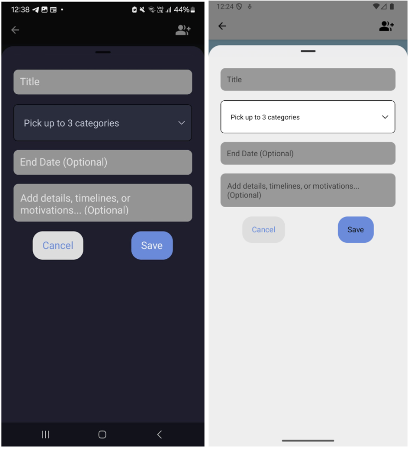
    
<em>Goal Creation Modal in Dark and Light Themes</em>

On the sublist page, we have also implemented a bottom-sheet modal for goal creation with field validation integrated to check that the goal’s title is filled before submission. 

Setting a deadline for the goal is optional. All deadlines have the time standardized to 11:59:59 PM (one second before midnight) to ensure that it represents the end of the selected day.

We used [Day.js](https://day.js.org/) with the relativeTime plugin to display helpful and user-friendly deadline information, e.g.: Due: in 2 hours (12 Aug 2025). For more details on how the estimated time difference is obtained, see the[ Day.js `fromNow` documentation](https://day.js.org/docs/en/display/from-now).

When a goal is clicked, the user will be dynamically routed to the Goal Journaling Page where event journaling will take place. More details on this can be accessed in [Feature 5](#5-event-journaling).

##### **Challenges Faced**

We encountered layout conflicts when rendering modals; the ‘Share List’ modal failed to overlay correctly or affected the positioning of other contents and the ‘Create Goal’ modal was not visible when opened on screen. To address this, we tried out different styling props on parent and child containers and explored alternative libraries (e.g. switching from a stack screen to react-native’s Modal then to react-native-modal for ‘Share List’ modal) to gain improved control over animation, positioning, and backdrop behavior.

Additionally, some interactive components exhibited occasionally unresponsive touch feedback, particularly on smaller components. We addressed this by refining styling properties (e.g. increasing padding and hitSlop to enlarge tappable areas).

Initially, the swipe-to-delete feature for sublists and goals was implemented by swiping right to reveal a delete button on the left. However, this configuration resulted in issues where the delete button was unclickable. We decided to switch to swiping left instead, which solved the issue and aligned better with common UI patterns.

##### **Future Plans**

Aside from refactoring search-and-filter logic for greater cohesiveness, we hope to implement sorting of sublists by their date of update, date of creation, and by title in alphabetical order. This would be helpful in sifting through large volumes of sublist items as app usage grows over time.

### 3. Adding of friends

#### Deliverables

Users can add friends by searching for a specific username and clicking on the add friend button to send a friend request. Users will receive friend requests via in-app notifications which they can accept or reject. Upon acceptance, a mutual friendship is established, thus both users appear in each other’s friends list. Friends can be removed through the remove friend button on their respective profile pages, which also updates the friendship status for both parties.

The following screenshots display the View Friends, Add Friends, and Profile screens, as well as the friend request notification for this feature.

    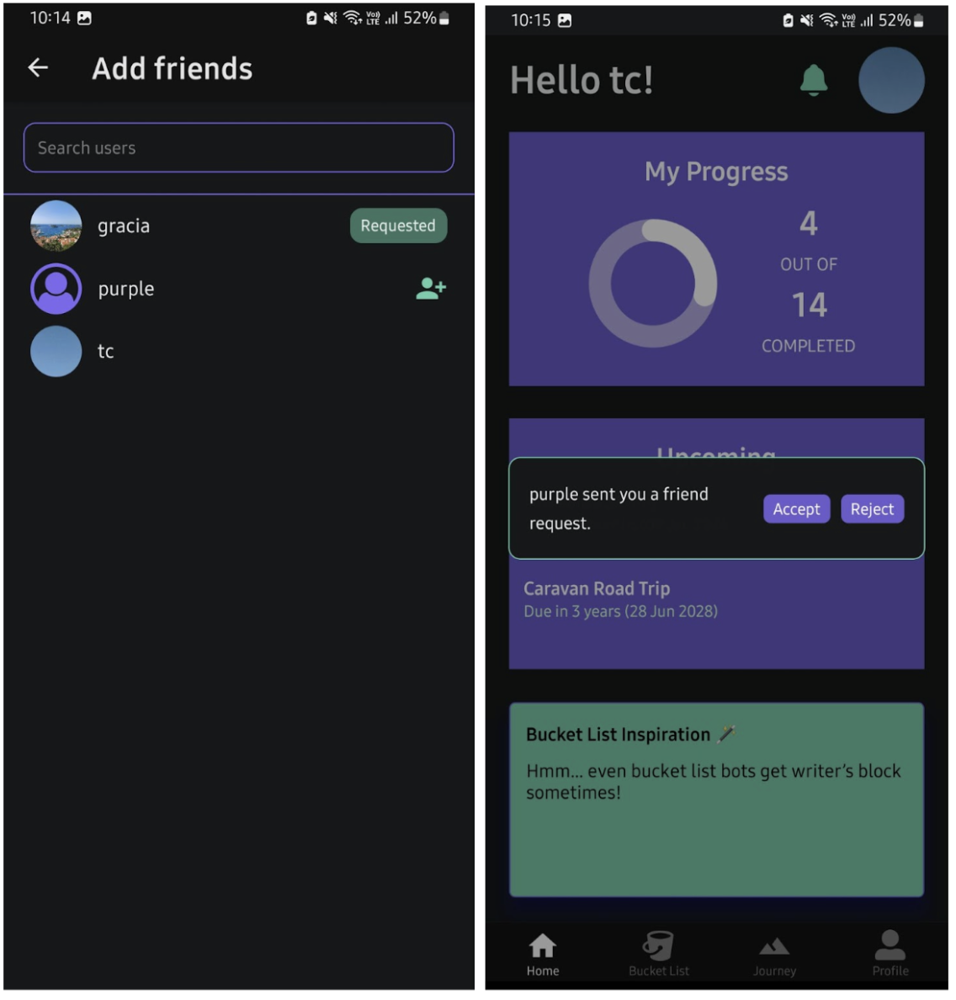
    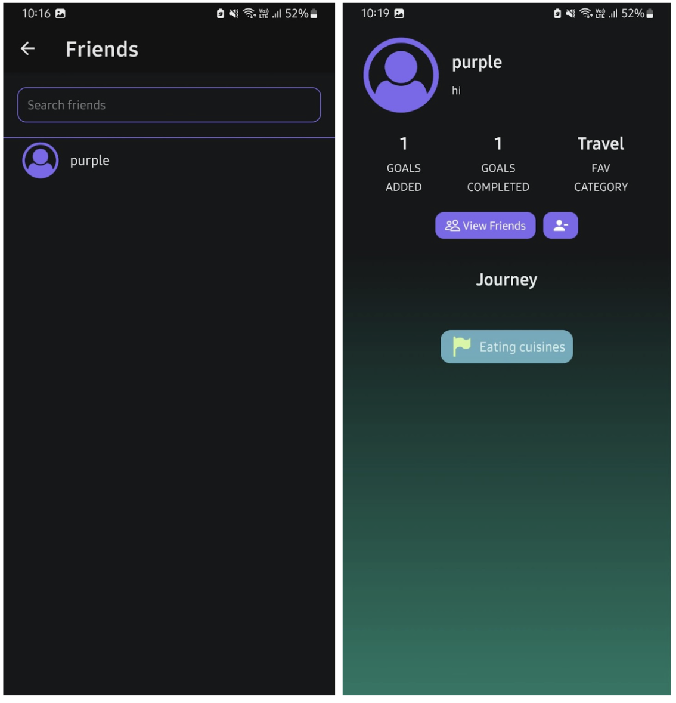
    
<em>Add Friends feature in Dark Theme</em>

### 4. User collaboration

#### **Deliverables**

This feature is built for shared goals that users wish to pursue together with their friends or family. Any collaborator can update a sublist’s title and description, as well as create, update or delete goals. Only the owner can modify the sublist’s visibility and delete a sublist. 

Currently, our API endpoint for fetching collaborators is configured to accommodate up to 100 collaborators per sublist, excluding the owner. 

When the following events occur:

1. A goal is added, edited, or removed;

2. A sublist’s title, description or visibility is updated in Firestore;

As with any collaborative platform, real-time data synchronisation is key for a seamless user experience across multiple devices and user accounts. It ensures users always have access to the latest data, and that changes made by any collaborator are reflected timely for every participant.

With this in mind, we decided to use Cloud Firestore’s onSnapshot listener to enable each sublist collaborator to be able to view the latest updates instantly without requiring a manual refresh. The OnSnapshot method sets up a persistent listener on a Firestore document or collection. When any data at the target location changes, the listener is automatically triggered and receives the most current snapshot of the data. This set-up maintains state consistency across multiple devices or users viewing the same sublist.

Additionally, we have used Firestore’s runTransaction for atomic updates (writes) like adding, updating, and deleting a goal, or updating the completion status of a goal. Transactions are important in this case as changing the goal count or updating its status also affects the user’s overall stats, as well as the date/time of update and completion status of the sublist (for both the original and shared copies). Furthermore, the server needs to read the sublist’s current completion statistics before updating it whilst ensuring that no other writes happen in between.  Firestore transactions help to prevent version conflicts when concurrent edits occur.

We also executed multiple write operations (e.g. set, update, delete) as a single atomic batch. Combining writes reduces network overhead, and if any operation fails, the entire batch is rolled back.

While working on a specific goal, collaborators can document their experiences and reflections by posting images and/or text. This journaling process will be elaborated on in greater detail in [Feature 5](#event-journaling-2)**.**

#### **Challenges Faced** 

We had difficulty deciding how the database should reflect the event of a user adding collaborators to a sublist. The most straightforward way would be to store a copy of the sublist under each collaborator. However, if one collaborator makes changes to the sublist, all copies need to be updated consistently and this increases the risk of copies becoming out-of-sync. If we stored a single source of truth with references, it would ensure that all collaborators always see the latest version. However, it would result in more complex querying and firestore rules. Our final decision was to store the sublist under the owner and collaborators added would store a reference to that copy in their sharedSublists collection. We also included a collaborators array for each sublist and event to make querying easier.

Another key challenge was deciding on the best practice to adopt for managing Firestore reads whilst allowing all collaborators who are actively viewing the Sublist Details page or Goal Journaling page to see the latest updates by fellow collaborators. We considered setting up an onSnapShot listener on these screens, but we realised that the listener also requires a document reference to the original copy of the sublist, which in turn requires knowledge of the ownerId. This means that whenever the screen is mounted, a GET request needs to be sent to first locate the owner’s copy of the document and fetch the ownerId before onSnapShot is set up. But this approach would incur extra reads and is unsustainable, since sublist and goal data are always re-fetched on screen focus. Thus, we decided to set up Zustand to keep track of the ownerId within app sessions so that the Firestore listeners can be instantly set up on screen focus.

With onSnapshot set up, we had to take extra care to prevent race conditions by removing manual state updates to sublist metadata (e.g. collaborator ID array) and relying on Firestore’s onSnapshot as the single source of truth.

During API testing via Insomnia, after we successfully ran the POST request for email/password sign-in, we received repeated failed requests for protected routes (error status 401—Unauthorized client error). We spent a lot of time attempting to identify the source of the error, as we were already signed in with the Firebase ID token retrieved and correctly configured with the Authentication Header. We had also corrected the formatting of the request body but still encountered the same error. On returning to our code, we realised that having identical response messages and lack of console logs in our token verification middleware was not helpful for error tracing. Thus, we refined each response message with labels pinpointing the source of error (e.g. “Invalid token”), and added a console log for errors thrown when getAuth.verifyIdToken(token) was invoked (i.e. console.error("Token verification error:", error). This helped us locate the error—an incorrect file path for our Firebase Admin service account file.

#### **Possible Add-Ons** 

To enhance flexibility in sharing sublists, a possible add-on would be to add support for tiered collaborator roles. Roles may include ‘Viewer’ (read-only access) and ‘Editor’ (can modify sublist content), with the owner retaining full control. This enhancement enables users to limit editing to trusted collaborators, reducing the risk of accidental or unwanted changes to shared content. This would be useful if collaborators only need to track progress or stay informed without contributing directly to content.

Future iterations of NextUp could integrate shareable links for created sublists, with 2 access options—Only people with editing permissions can access with the link to view/edit the list; or any registered user with the link can edit.

### 5. Event Journaling

#### **Deliverables**

For goals that are in progress or marked as completed, users can post comments and/or photos documenting their journey under that event. Posts are ordered by their date/time of creation, with the topmost post being most recently added. This allows for chronological journaling that reads like a timeline.

Each post will be labelled with the author’s username and profile picture, along with the date and time of posting. Posts are editable for flexibility in fixing typos or adding more details. All collaborators can view one another’s posts. 

Currently, there is no set limit on the number of posts/images allowed for each goal, or the maximum number of characters for text inputs.  

    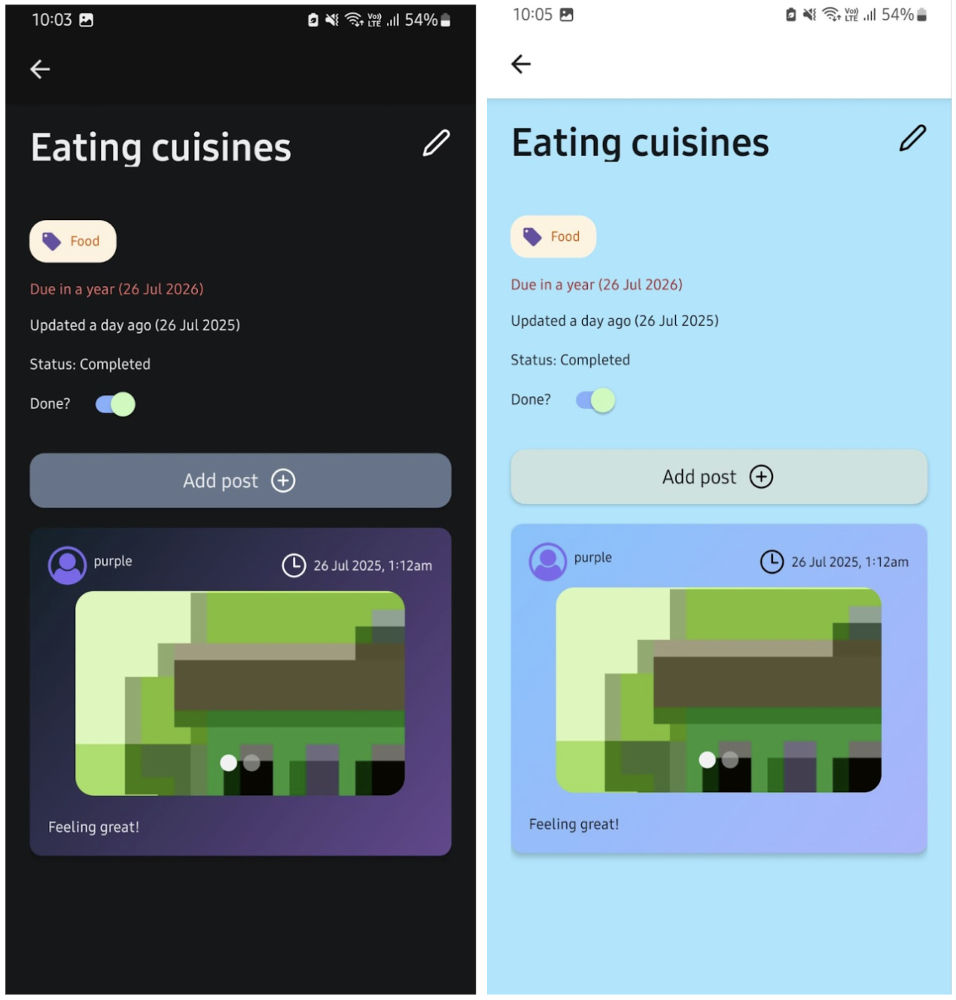
    
<em>Actual Implementation of Event Journaling Screen in Dark and Light Themes</em>

#### **Current Progress**

##### **Design Considerations**

For each post, we decided to allow up to 5 image uploads. This gives users greater flexibility in documenting their experiences richly. Some users may prefer just having one image per post for a cleaner timeline-style documentation, while others may wish to batch media to avoid spamming the feed, especially if they wish to share a moment through multiple angles or snapshots.

#### **Challenges Faced**

Image Loading: OutOfMemory (OOM) Issue

While implementing the image carousel feature for each post, some images were not appearing in the carousel. To address this, we set a temporary visible border to check if it was an image loading issue or a layout problem, and used the built-in onError handler on our Animated.Image component: onError={(e) => console.log("Image failed to load", e.nativeEvent)}

Subsequently, we realised that the app had hit a native image decoding memory limit (“Error: Pool hard cap violation”), a common issue stemming from loading too many large, uncompressed high-resolution images at once. 

To fix this issue, we used resizeMethod=”resize” on Animated.Image to reduce the decoded image memory on Android. We also rendered compressed or resized versions of post images via Cloudinary q\_auto, w\_720. q\_auto is Cloudinary’s quality and encoding algorithm which strikes an optimal balance between file size and visual quality. Such downsampling avoids unnecessary memory usage, improving app performance without quality loss. To avoid malformed image fetch requests, we added an extra check for image URLs with encodeURI().

#### **Possible Add-Ons**

We are considering integrating editing functionality for posts to provide greater flexibility in the journaling process. We also hope to allow users to take photos directly in the app on top of picking existing photos from their media library.

Future iterations of NextUp could also integrate optional location tagging for posts. This would let users attach a place to their reflections or images when completing a goal, adding personal context or helping to track where milestones happened. It also opens the door to related features like memory maps and location-based goal search.

### 6. Milestones Record

#### **Deliverables**

Each user has a Journey page that brings all completed goals in one place. Without it, achievements remain scattered across sublists, making it difficult to revisit everything one has accomplished. This centralised view serves as a personalized memory lane that celebrates progress and fuels positive momentum.

At the same time, it is also a social sharing tool, allowing users to selectively share milestones. The visibility settings for each sublist gives users control over who can see their past achievements, reinforcing a sense of trust and privacy within the platform. Through exploring others' journeys, users can discover fresh ideas, gaining insights and motivation even from goals outside their personal interests, potentially enriching their journey of growth.

The visibility of a goal on the Journey page depends on:

1. **Who is viewing the page**, and

2. **The visibility setting of the sublist the goal belongs to.**

- **If the viewer is the account owner**: 

  - All goals are visible.

* **If the viewer is a friend of the account owner**: 

  - Goals in sublists with visibility set to _Friends_ or _Everyone_ are visible.

  - Any goals in _Private_ sublists where the viewer is listed as a collaborator are also shown.

- **If the viewer is neither the account owner nor a friend**:

  - Only goals in sublists with visibility set to _Everyone_ are visible.

    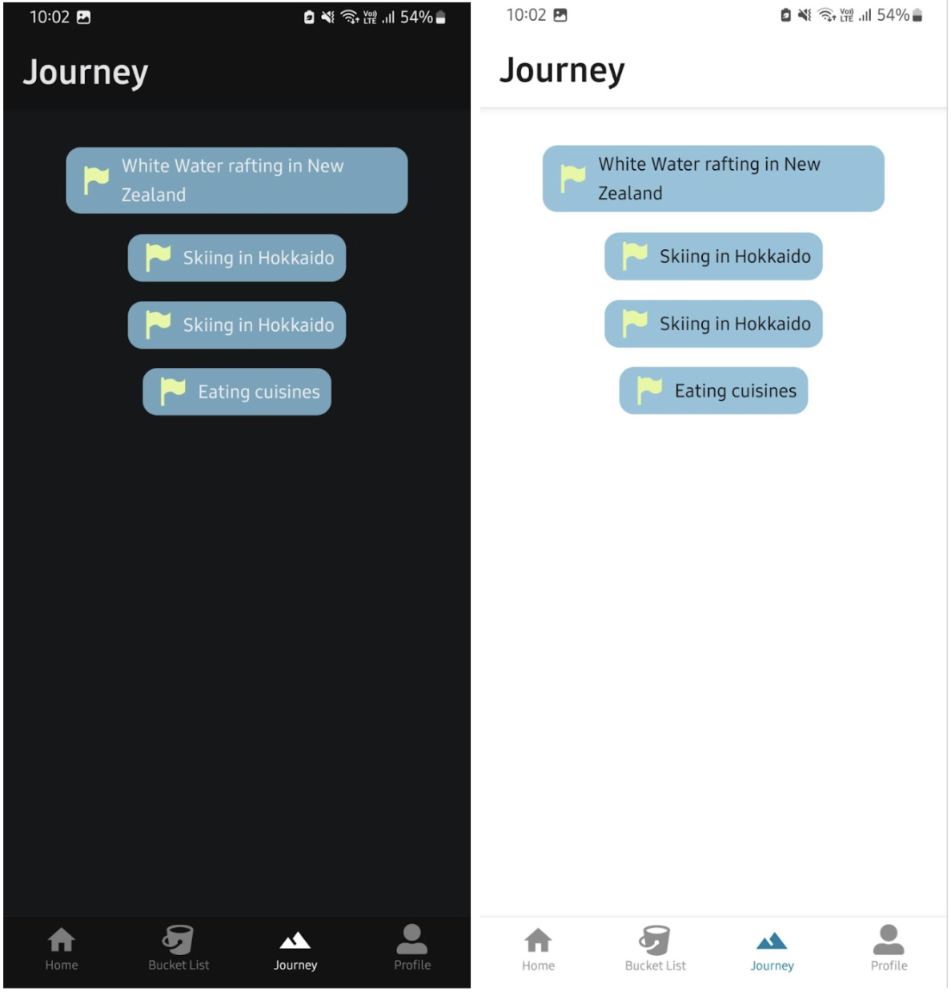
    
<em>Actual Implementation of Journey Screen in Dark and Light Themes</em>

#### **Challenges Faced** 

As there are multiple access levels to handle, we needed to write queries that reflect the viewer’s relationship to the owner of the Journey page and the access level of the sub-bucket list the event belongs to. ****We had to ensure users cannot see content they do not have access to, both on the frontend and enforced by Firestore security rules. This made the data fetching logic rather complex.

#### **Future Plans** 

Currently, the Journey page does not allow users to click on the displayed goals to access their respective journaling pages. This functionality is not yet in place as our current backend does not authorise non-collaborators to view the goal journaling page of sublist goals. If time permits, we hope to refactor our backend access logic to allow viewers to access the journaling page of completed goals displayed in another user’s Journey page.

### 7. Customisable Profile

#### **Deliverables**

Each user can customize his profile picture, bio and favourite category by clicking on the ‘Edit Profile’ button, which displays the Edit Profile modal. Within this modal, users can upload a new profile picture from their device’s gallery, update their bio and select up to one category using the category picker. Upon saving, a success alert should appear and the profile page will be updated.

****

    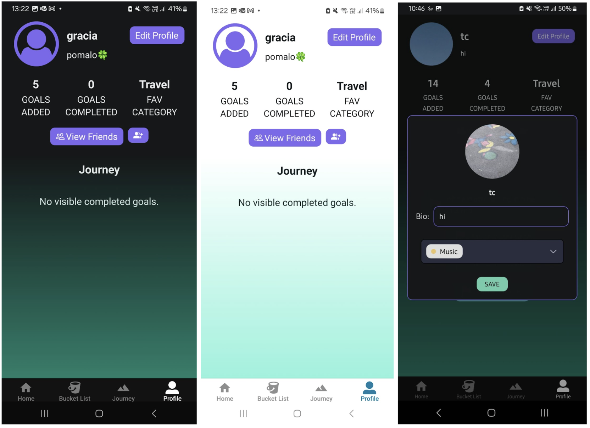
    
<em>Actual Implementation of Profile Screen in Dark and Light Themes</em>

### 8. Display of User Progress

#### **Deliverables**

****

    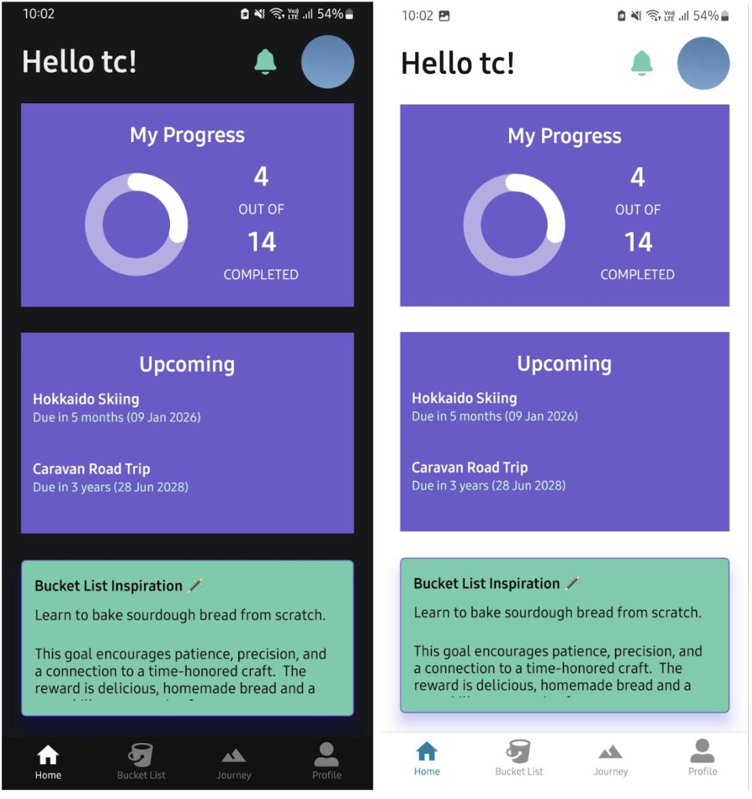
    
<em>Actual Implementation of Home Screen in Dark and Light Themes</em>

The total number of goals a user has and the number of goals the user has completed will be displayed on both the home and profile pages. On the home page, the user’s upcoming goals and number of overdue goals, if any, will also be shown. The Bucket List page also displays the number of goals created and completed for each sublist.

#### **Challenges Faced**

We had difficulty deciding what was the best way to update user statistics. Initially, we created a document for each user that stored the user’s overall statistics. This document was updated directly whenever the user added or deleted a goal or removed a sublist. However, to ensure accuracy, we considered summing data on the spot using statistics from all sublists when the user navigates to the relevant screens. Although this allows for up-to-date stats, it may be inefficient if a user has many sublists and events. Therefore, to balance performance with accuracy, we retained the overall stats document but introduced a function to update it by summing statistics from sublists whenever changes occur.

### 9. Notifications

#### **Deliverables**

A notification bell is displayed at the top of the home screen. By default, if users do not have new notifications, the bell is static. When a user is invited to collaborate on a sublist, or when he/she receives a friend request, a ringing bell animation will be triggered with a 4-second pause between shakes. By clicking on the bell, the user will be able to view and dismiss these notifications. Friend requests can be accepted or declined.

#### **Possible Add-Ons**

A potential enhancement would be to integrate push notifications to remind users about upcoming goals, overdue ones, or stale sublists.

###  10. AI-powered Event Suggestions

#### **Deliverables**

A bucket list goal suggestion will be fetched from the Gemini API and displayed on the Home screen when the screen component mounts, or whenever the authenticated user's user ID changes (e.g. on login or app reinitialization). This inspires new bucket list ideas.

    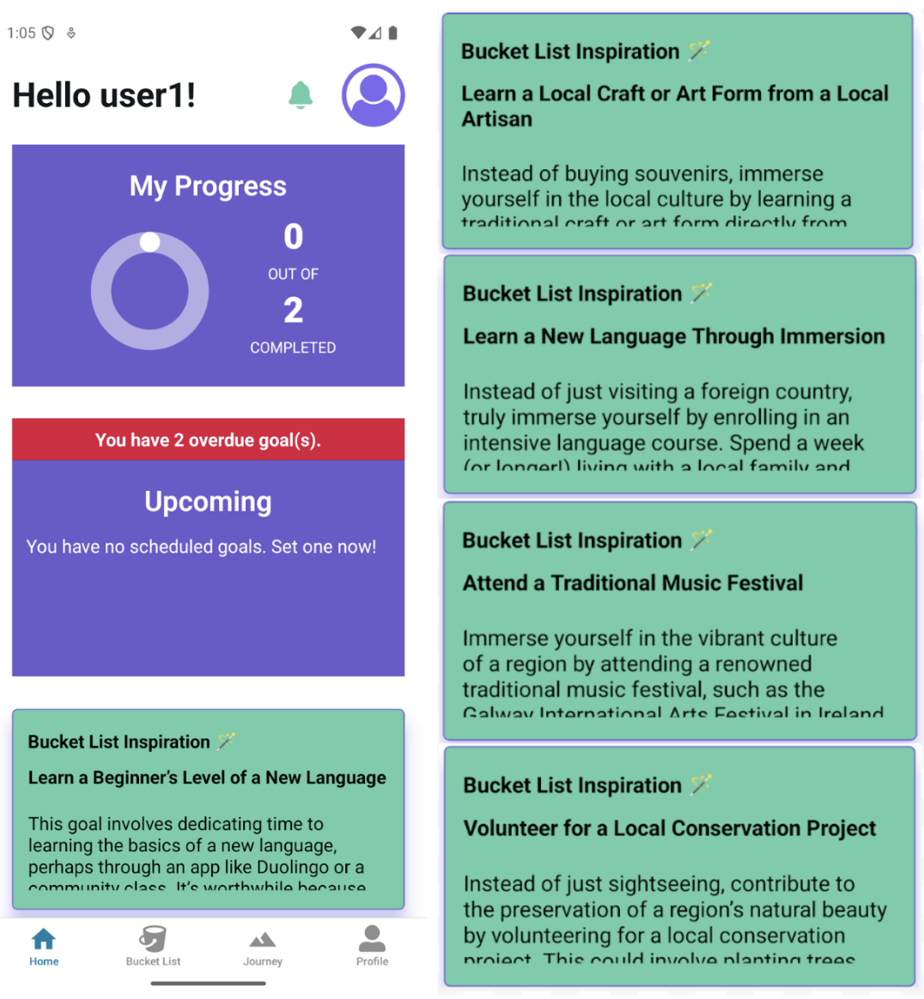
    
<em>AI Suggestion Feature in Light Theme</em>

    
<em>(Left: Home Page, Right: Sample Suggestions Generated)</em>

#### **Possible Add-Ons**

Triggering a goal suggestion only on userId change might limit the feature’s usefulness as it does not support real-time exploration or engagement. Thus, the following feature enhancements could be considered:

1. **Manual refresh**: 

   - Enable users to fetch new ideas on demand

   - A daily fetch limit might have to be imposed per user to avoid exceeding query limits

2. **Contextual, personalised suggestions:** 

   - Personalise Gemini prompts using data such as the user's favourite category and categories of existing goals 

   - Optionally let users input their preferences (e.g. type and purpose of activity) before generating a suggestion

### **Application Design** 

#### **Technology Stack**

**Frontend**

The frontend was built using React Native, an open-source JavaScript framework and one of the most popular cross-platform mobile frameworks among developers worldwide. We utilised Expo, a production-grade React Native Framework that streamlines app development via file-based routing and a standard library of native modules (e.g. expo-camera, expo-notifications) which offers easy access to device and system functionality. This setup enables us to focus more on feature development without getting bogged down by pain points that have already been addressed many times.

**Client-based User Authentication**

We decided to use Firebase Authentication for user authentication and onboarding as it provides backend services and easy-to-use SDKs for smooth integration and secure authentication. Firebase Authentication supports multiple authentication methods, including email/password, phone number, and social login (Google, Facebook, Twitter, GitHub). Currently, we have implemented email/password sign-ins, but with the rising popularity of passwordless authentication in customer identity and access management platforms, we aim to integrate greater sign-in flexibility and convenience via third party OAuth providers like Google. 

By default, Firebase Auth uses an in-memory persistence; thus, we used React Native AsyncStorage to ensure the user remains logged in between app sessions. 

**Database Storage**

We chose Cloud Firestore to store, retrieve and query user data, such as bucket lists created, user profile, friend connections, and completed goals. Cloud Firestore is a flexible, scalable NoSQL Google Cloud database that offers real-time synchronisation across client apps, offline support, and scalability. It is well-suited for a multi-user collaborative application like ours, where users can create and share goals dynamically. Additionally, Firestore integrates seamlessly with Firebase Authentication.

**Media Cloud Storage**

We plan to use Cloudinary media uploads and storage as part of our journaling feature. Cloudinary offers developer-friendly API and SDKs, with a robust, scalable infrastructure designed to support high loads and vast amounts of multimedia assets.

We used signed uploads which requires an additional `uploadSignature` parameter, our API key and the data of the image being uploaded and our API key. This ensures all media assets are securely uploaded to Cloudinary and protects our Cloudinary account from unauthorized access.

**CRUD (Create, Read, Update, Delete) operations**

In Milestone 2, we employed Firestore’s Client SDK to perform all CRUD operations for user profiles, sub-bucket lists and individual goals. This comprises actions such as creating sublists, fetching a user’s friends, updating goals and deleting goals, all executed securely via Firebase Authentication and configured Firestore rules on the client side.

This was because we found Firestore’s Client SDK to be fairly efficient and effective for our project’s scope, with the following advantages:

1. **Rapid development**: Direct client-side access simplifies logic and reduces the need to maintain an additional custom backend or deploy additional services during early development.

2. **Adequate security**: Cloud Firestore’s **security rules** provide detailed access control and data validation with a flexible rules syntax. This makes for safe enough interactions where an attacker is only able to modify their own data.

3. **Fast performance and real-time updates:** The Client SDK’s local caching capabilities and listeners fulfills high speed and real-time data requirements.

However, the collaborative nature of our app demanded complicated access control, as collaboration involves granting access to other users outside the document owner's userId namespace. This introduced security challenges, where client-side security rules either need to be relaxed or refactored to integrate unnecessarily complex conditional logic (fragile, error-prone, and hard to scale). Thus, to we decided to implement a combined usage of Firebase Client and Admin SDKs: 

<table>
  <tr>
    <td><strong>Client SDK</strong></td>
    <td>Snapshot listeners on bucket list, sublist creation, sublist details and goal journaling screens</td>
  </tr>
  <tr>
    <td><strong>Admin SDK and Express.js</strong></td>
    <td>
      All other operations, including:
      <ul>
        <li>CRUD operations for sublists, goals and their associated posts</li>
        <li>Inviting/Removing collaborators</li>
        <li>Creating, retrieving and updating user profiles (including uploading images to Cloudinary)</li>
        <li>Adding/removing friends</li>
        <li>Generating AI-powered goal suggestions</li>
        <li>Notification handling</li>
      </ul>
      
Routing requests through server-side API allows for tighter control over access logic, ensuring client-side security rules remain robust.

    </td>
  </tr>
</table>

This setup combines the speed and real-time capabilities of client-side access with the enhanced security of server-side operations (particularly for sensitive tasks like user sharing).

We have deployed RESTful APIs for all server-side operations. RESTful APIs adhere to the principle of ‘Separation of Concerns’ as they promote a clear separation between client and server, enabling each to evolve independently. Furthermore, the Firebase Admin SDK offers privileged access to Firebase services from trusted environments, beyond what client SDKs allow. It also enables easy integration with other services such as analytics or third-party APIs, supporting the extensibility of our app. Indirect database access, albeit slightly slower than direct access, performs well in complex data processing and adds an extra security layer—especially critical when handling sensitive user information.

**Backend Server Hosting**

We hosted our backend server on Render. Render was selected for its simplicity, auto-deployment from GitHub and reliability for backend-heavy applications. In addition, there is no usage limit. However, our free instance spins down with inactivity, resulting in delayed response times, especially on the first request, causing our app to appear slow when initially loading.

**State Management**

We have deployed Zustand for global state management of sublists and the current user. Zustand is a fast and scalable state management library for React and has minimal boilerplate.  It allows for easier state sharing across views or screens. It helps developers avoid excessive prop drilling and unnecessary re-renders of local states handled using React context, improving app performance in the long run.  

Zustand also facilitates Separation of Concerns by keeping state logic out of UI components wherever possible. This encourages cleaner architecture and makes it easier to test, debug, and reason about. 

**AI-powered Goal Suggestions**

We used the Gemini 2.0 Flash model to generate bucket list goal suggestions due to its high token count per minute relative to other models as well as its reliability.

**User Interface Design**

NextUp supports both light and dark themes with responsive font-sizing.

We used Figma and Google Docs to draft initial designs and prototype user flows before implementation, as illustrated in the following figures.

    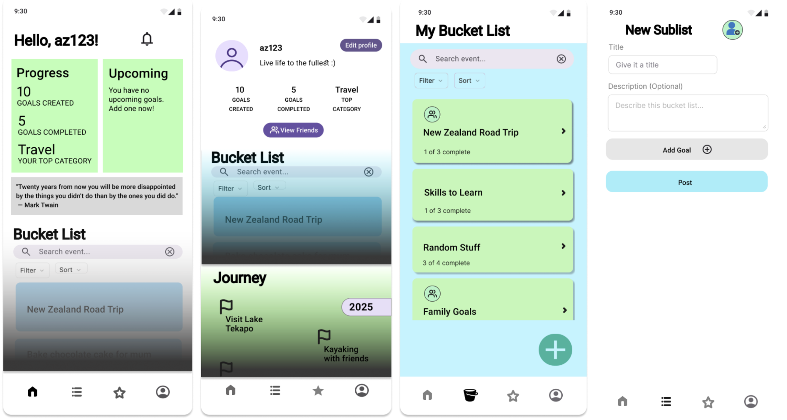
    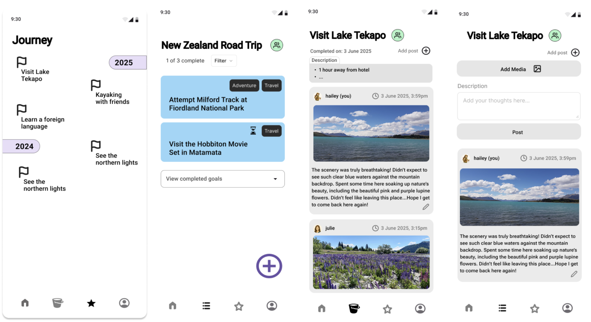
    
<em>Static Mid-Fidelity Figma Prototype</em>

    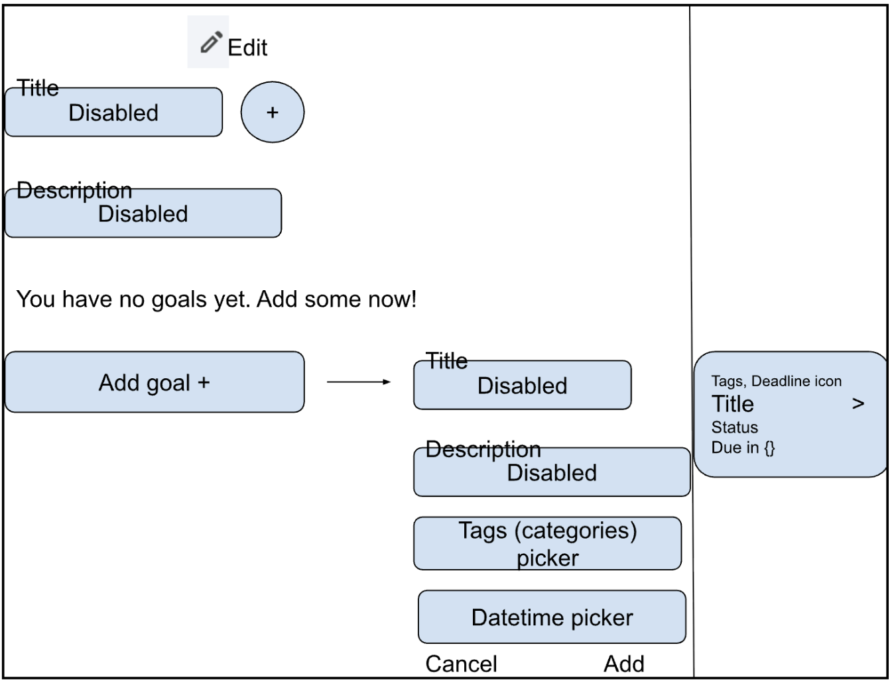
    
<em>Draft for Sublist Details Page</em>

#### **Frontend-to-Backend Authentication and High-Level Flow**

****

    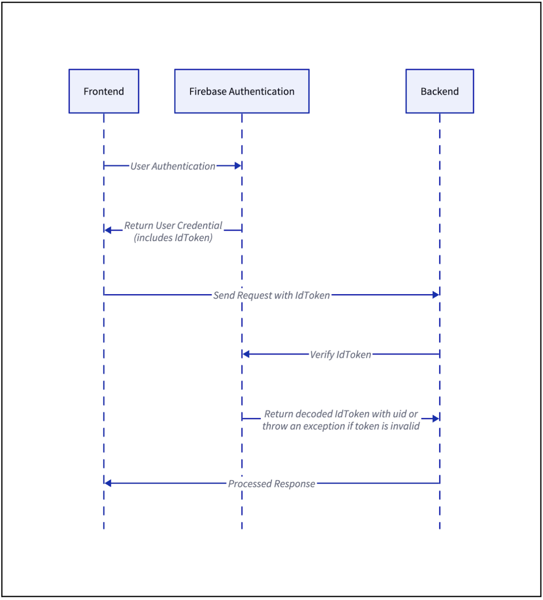
    
<em>Sequence Diagram Showing the HTTP Request Flow</em>

    
<em>(Generated Using D2, a Text-to-Diagram Scripting Language)</em>

#### Authentication & API Design

NextUp uses Firebase Authentication on the frontend and a custom REST API backend that securely handles user data. All API endpoints are protected via a backend authentication middleware.

##### **Request Flow**

1. **User authenticates via Firebase (Client-side)**

   - The user logs in using Firebase Authentication

   - Firebase returns a User Credential object, which includes a short-lived OAuth ID token

2. **Client sends authenticated request to backend**

   - The frontend sends a REST API request to the backend, attaching the ID token in the request header in the following format: _Authorization: Bearer \<ID\_TOKEN>_

3. **Backend verifies ID token**

   - The backend uses Firebase Admin SDK to verify the ID token

   - If the token is valid:

     - It attaches the user’s unique ID (uid) to req.user

     - Continues to process the request

   - If the token is invalid or expired:

     - The backend rejects the request with the error “401: Unauthorized Header (Invalid Token). Access Denied"

4. **Backend Returns Response**

   - Once authenticated and processed, the backend returns the appropriate JSON response.

   - The frontend handles the response and updates the UI accordingly.

By attaching the authenticated user’s UID to req.user, the token verification middleware reduces the need to pass :userId in the URL path of protected routes. This allows for cleaner, less error-prone routes, and prevents users from spoofing other user IDs in the URL, as the server always trusts the UID from the token, not the client.

**Backend Internal API Endpoint Structure** 

The following are some of the main endpoints implemented:

- `/api/user/bucketList: `The endpoint to create a new sublist or retrieve all sublists (owned and unowned)

- `/api/user/sharedSublists:` The endpoint to fetch all _unowned_ sublists, i.e. sublists that are shared with the current user

- `/api/user/bucketList/owned:` The endpoint to fetch all _owned_ sublists

- `/api/user/bucketList/stats: `The endpoint to fetch user stats

- `/users/:uid/profile: `The endpoint to fetch a user’s profile

- `/api/cloudinary/signature: `The endpoint to upload post images and profile pictures to Cloudinary

- `/api/user/bucketList/:sublistId: `The endpoint to fetch, update and delete a sublist

- `/api/user/bucketList/:sublistId/events: `The endpoint to create a new goal

- `/api/user/bucketList/:sublistId/events/:eventId:` The endpoint to fetch, update and delete a goal

- `/api/user/bucketList/:sublistId/events/:eventId/posts:` The endpoint to create a new post under a goal 

- `/api/user/bucketList/:sublistId/events/:eventId/posts/:postId: `The endpoint to fetch, update and delete a post

- `/api/user/bucketList/:sublistId/events/:eventId/toggleCompletion: `The endpoint to toggle the completion status of a goal and update the sublist’s completion status and user’s stats accordingly

- `/api/user/bucketList/:sublistId}/collaborators/:collaboratorId: `The endpoint for the owner to add and remove a sublist collaborator, and for the current user to remove himself/herself as collaborator

- `/api/users/updateProfile: `The endpoint to update a user’s username, profile picture, bio, and/or favourite category

- `/api/sublists/invites:` The endpoint to fetch all collaborator invitations received by a user

- `/api/events/upcoming`: The endpoint to fetch all goals with upcoming deadlines

- `/api/events/overdue:` The endpoint to fetch all overdue goals

- `/api/friends/add`: The endpoint to add a user as friend (i.e. accept a friend request)

- `api/friendRequests/:requestId/reject: `The endpoint to reject a friend request

- `/api/users/:currentUserId/friends: `The endpoint to fetch all friends of the current user

- `/api/users/:uid/friends/:friendId:` The endpoint to remove a user as friend

- `/api/users/batch`: The endpoint for batch fetching collaborator profiles

- `/api/gemini/generate`: The endpoint to generate goal suggestions

**Note**: While the current API structure works as intended, it does not strictly follow conventional REST naming practices. Future refactoring may be done to improve route structure and naming consistency.

##### **Zustand State Management**

This project uses[ Zustand](https://github.com/pmndrs/zustand) for global state management of:

- Current user’s profile

- Sublists, goals within each sublist, and posts within each goal

In UserStore, the authenticated user’s profile details are cached for usage across multiple screens to eliminate the need for refetches each time a relevant component is mounted.

    interface UserStore {

     user: User | null;

     setUser: (user: User) => void;

     clearUser: () => void;

    }

In SublistStore, the sublist-goals-posts hierarchy is stored and managed as shown:

    sublistData: { [sublistId: string]: Sublist };

     sublistOrder: string[]; // store array of sublist IDs

     goalsBySublist: Record<string, Record<string, Goal>>;

     goalOrderBySublist: Record<string, string[]>; // store array of goal IDs for each sublist

     postsByGoal: Record<string, Record<string, PostWithPending>>;

     postOrderByGoal: Record<string, string[]>;

Instead of storing arrays of objects directly fetched from Firestore, we decided to utilise the Record-cum-order array pattern as it offers greater performance, scalability, and maintainability benefits. 

1. Fast item lookup:

   - This structure enables direct item access by id in constant time, whereas item arrays can only be searched in O(n) time. 

   - This avoids expensive item finding, item updates and deletions from the zustand cache, especially when the data collection grows.

2. Clean, efficient immutable state updates

   - **This structure allows** updating only one entry without rebuilding the whole Record.

   - Updating arrays immutably often entails mapping or filtering, which is more verbose and less efficient.

3. Explicit, efficient order control

   - The Order array (e.g. `goalOrderBySublist[sublistId]`) stores the exact sort order of item ids

   - Record stores the objects themselves.

   - This separation makes reordering of cached data easier, and avoids expensive array.sort() calls on render or the need to refetch the entire sorted array of objects from Firestore to maintain sort order. This is especially helpful for collaborative apps where updates are typically more frequent. 

4. Avoids accidental duplication

   - By storing arrays of objects, one could risk having multiple copies of the same object by accident (e.g. the same goal in multiple places)

   - This can be avoided through employing record-based storage

When subscribing to cached states (e.g. sublist data, list of posts), we used the useShallow hook to avoid unnecessary rerenders if the computed value is always shallow equal to the previous one.

##### **Real-time Data Flow**

The following outlines the process of keeping NextUp’s UI in sync with Firestore using real-time listeners and the global Zustand store.

    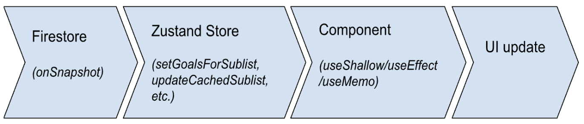

1. **Firestore Snapshot Listener**

   - The app sets up Firestore onSnapshot listeners on sublist collections (BucketList Page) the sublist (Sublist Details Page), goals collection (Sublist Details Page), and individual goal data along with its post collection (Goal Journaling Page).

   - Any changes in Firestore (e.g. updates, additions, deletions) triggers the snapshot callback.

2. **Update Zustand Store**

   - The snapshot callback processes the latest data and updates the global Zustand store (e.g. sublistData, goalsBySublist). This is done via setter functions created in UserStore and SublistStore.

   - This ensures all components using the store have access to the latest data.

3. **Trigger useEffect**

   - Components subscribe to relevant parts of the Zustand store.

   - When the store updates, React’s useEffect or useMemo hooks respond to the changes.

4. **Update UI State**

   - The UI automatically re-renders to reflect the latest Firestore data.

   - For example, updated goals, collaborators, or sublist details appear instantly without manual refresh.

Global and local states

For sublist and goal components with editing modes, we combined the use of zustand with React’s useState. This keeps the UI in sync with the latest data from Zustand store whilst allowing for local edits without immediately updating the global state. This combined approach also allows for changes to be easily reverted when editing is cancelled.

#### ****

    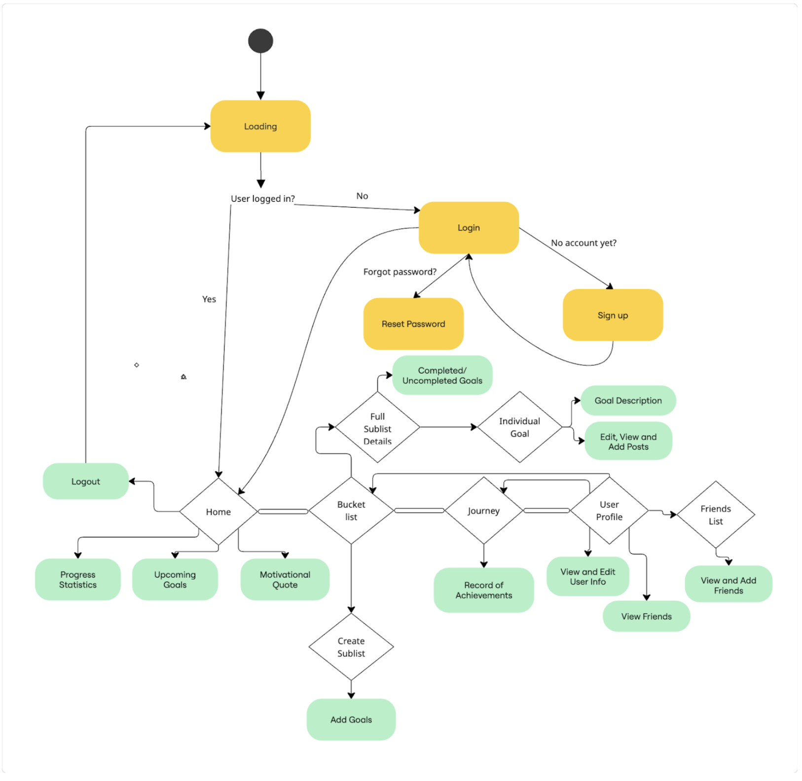
    
<em>UML Activity Diagram</em>

### Software Engineering Practices

**Don’t-Repeat-Yourself (DRY) Principle**

The DRY principle underscores the importance of avoiding code duplication. We seek to apply this by creating reusable abstractions that can be used across our app. 

Component Composition
A fundamental concept in React development, component composition supports the development of complex UIs by combining smaller, reusable components. Each smaller, self-contained component handles a specific task or represents a specific element.

The importance of component composition was made clearer to us as we developed our Goal Journaling feature. While implementing dynamic image carousels for posts, we struggled with managing animated values like useSharedValue and useRef without violating React's strict Rules of Hooks. Initially, we attempted to initialize these values inside useEffect, useMemo, or loops, which led to invalid hook call errors, as hooks must only be called unconditionally at the top level of React functions. 

To resolve this, we adopted a cleaner approach that involved creating a PostItem component and defining all animated values like useSharedValue and useRef directly inside PostItem. This not only eliminates reliance on workarounds like useMemo or hook-like logic but also aligns with the principle of composability in software development. Each post item now manages its own animation state in isolation, making the UI logic modular and maintainable.

For components that share some common functionality or styling attributes, base components can be created and composition can be applied to reuse this code across the components. For instance, we can create a base FormField component for text input fields in our Login, Sign-up and Reset-password screens and implement the Email, Username and Password fields as components that use FormField, with the flexibility to add additional functionalities on top of the base component. This makes our code for three authentication screens cleaner as they only show _what_ it’s doing, not _how_ every field works; the _how_ is defined by FormField.tsx instead.

Helper functions

Creating helper functions to execute common tasks is another way to reduce code duplication and build a more maintainable codebase.

Constants

Rather than hard-coding values, constants can be used to define commonly used values. For instance, colour values for our app’s colour theme can be defined using constants in a separate file.

Together, these approaches allow for clean, readable, maintainable and scalable code. 

**Reduce Coupling**

Coupling is a measure of the degree of dependence between entities such as components, classes and methods. High coupling is typically undesirable as it makes it harder to maintain, integrate, test, and reuse modules in different contexts. 

Composition Over Inheritance

While inheritance is another way to employ abstraction, we decided to use Composition over Inheritance; in Inheritance, components are tightly coupled. This means that any change in a parent component can bring unexpected consequences to its child components. Meanwhile, Composition keeps components loosely coupled. This makes it easier to manage evolving project requirements. 

**Separation of Concerns Principle**

Separation of Concerns (SoC) is a design principle for partitioning a computer program into distinct sections, where each section is responsible for a separate concern, minimizing the overlap of concerns as far as possible. 

Apart from breaking down our app into independent, reusable components, we separated container components  (responsible for logic handling) from presentational components (responsible for rendering UI). This enables presentational components to be reused with different data sources. This also supports unit testing as presentation can be tested separately from logic.

On a whole, SOC allows individual sections to be modified and debugged with ease.

**Git Version Control**

We adopted the Git Feature Branch Workflow with pull requests. 

Instead of committing directly to the main branch, we created a separate branch for each feature, made feature-specific changes, before submitting a pull request to merge these changes to the development (pre-production) branch. This allows for effective collaboration, systematic conflict resolution and a clean codebase.  

**Git Issues**

We utilised Git Issues to track task progress, feature requests and bug fixes. This workflow allows for categorisation via labels and deadline tracking via milestones.

**Github Project**

We utilised Github Project for progress tracking and work allocation. Weekly sprints are conducted to review code, assess completion of weekly targets, plan deliverables for the following week, and reassign responsibilities as needed.

    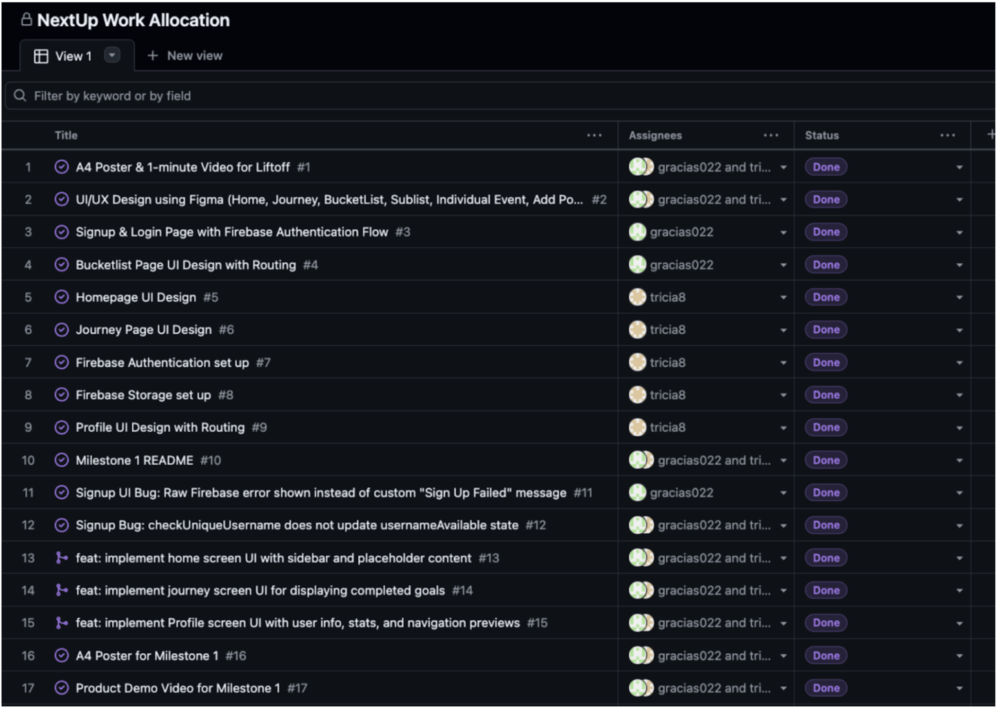
    
<em>Screenshot of GitHub Project Spreadsheet</em>

    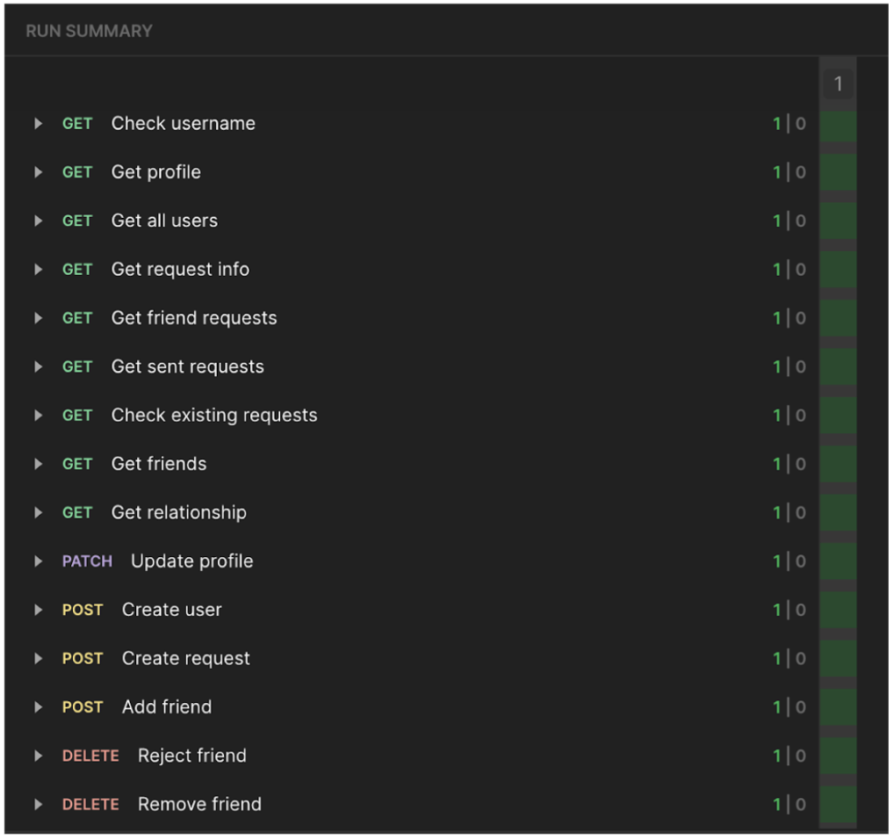
    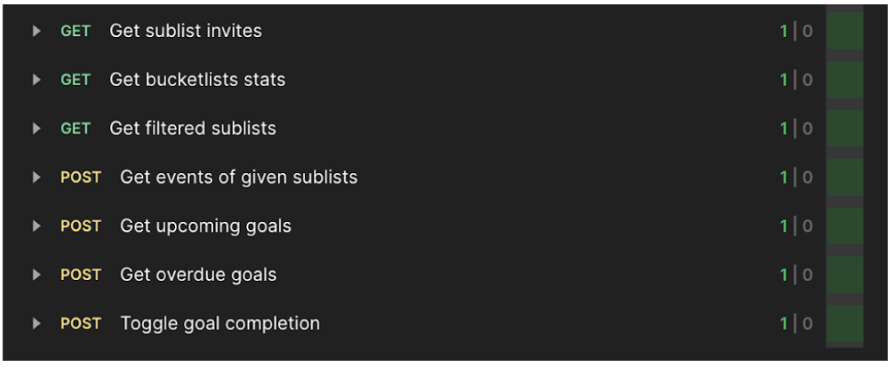
    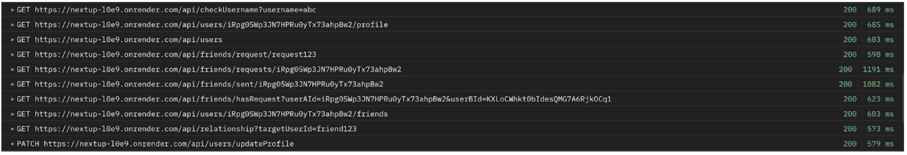
    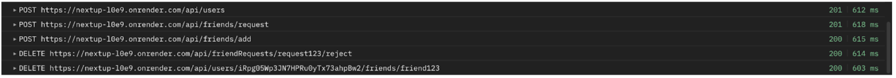
    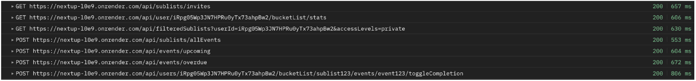
</div
    
****

**Challenges Faced**

Enabling automated testing of the self-removal HTTP request, which only allows collaborators to remove themselves from sublists they do not own. Self-removal is a destructive action for the test user—after executing it, the same API endpoint cannot be tested again with the same logged-in user unless the test database resets between runs, or another privileged test user adds them back. 

#### **Unit Testing** 

We performed automated unit testing on individual functions or components in isolation using Jest and React Native Testing Library, mocking dependencies as needed. These tests verify that the code works as expected according to our intended logic. This process helps us identify and fix bugs early in the development cycle so as to maintain a robust, reliable codebase.

|                       |                                        |                                                                                                                                                                                                                       |                 |                                                                                                               |
| --------------------- | -------------------------------------- | --------------------------------------------------------------------------------------------------------------------------------------------------------------------------------------------------------------------- | --------------- | ------------------------------------------------------------------------------------------------------------- |
| **Module**            | **Component**                          | **Objective of Feature & Test Case**                                                                                                                                                                                  | **Pass / Fail** | **Remarks**                                                                                                   |
| Authentication        | AuthLayout                             | Redirects authenticated user with verified email to main                                                                                                                                                              | Pass            |                                                                                                               |
|                       |                                        | Redirects authenticated user to login if email is unverified                                                                                                                                                          | Pass            |                                                                                                               |
|                       |                                        | Redirects unauthenticated user only once to login                                                                                                                                                                     | Pass            |                                                                                                               |
|                       |                                        | Does not redirect if navigation state is not ready / authentication is pending                                                                                                                                        | Pass            |                                                                                                               |
| Login                 | Text inputs                            | Input fields update state correctly.                                                                                                                                                                                  | Pass            | Suggestion: Can disable input fields when login(email, password) is called                                    |
|                       | Keyboard                               | Dismiss keyboard when 'Log in' button is pressed                                                                                                                                                                      | Pass            |                                                                                                               |
|                       | Sign up linked text                    | Sign up button routes to signup screen on press                                                                                                                                                                       | Pass            |                                                                                                               |
|                       | Reset Password linked text             | Reset password button routes to forgot password screen on press                                                                                                                                                       | Pass            |                                                                                                               |
|                       | Password visibility toggle             | Tapping the eye icon should reveal the password temporarily (for 5 seconds), after which password is auto-hidden                                                                                                      | Pass            |                                                                                                               |
|                       |                                        | Password visibility is toggled correctly when eye icon is tapped (eye/eye-off)                                                                                                                                        | Pass            | Icon does not respond to more than 1 successive taps with no buffer time in between due to the autohide logic |
|                       | Inline error messages                  | Frontend checks for empty email/password field on submit; expects an inline error message saying "Email is required"/”Password is required”                                                                           | Pass            |                                                                                                               |
|                       |                                        | Error message disappears when user starts typing in empty Email/Password field                                                                                                                                        | Pass            |                                                                                                               |
|                       | Login button                           | Should call login(email, password) with correct credentials only when both fields are filled and "Log in" is pressed                                                                                                  | Pass            |                                                                                                               |
|                       | Login button                           | Route user to home screen after successful login                                                                                                                                                                      | Pass            |                                                                                                               |
|                       | Error toast                            | Show user-friendly error toast for invalid credentials (e.g. wrong password, unverified email)                                                                                                                        | Pass            | Uses getFriendlyAuthErrorMessage()                                                                            |
| Sign Up               | Text inputs                            | Input fields update state correctly.                                                                                                                                                                                  | Pass            | Suggestion: Can disable input fields when handleSignup is called                                              |
|                       | Keyboard                               | Dismiss keyboard when tapping 'Create account' button is pressed                                                                                                                                                      | Pass            |                                                                                                               |
|                       | Create account button                  | Successful signup on click calls register and createUser with correct credentials                                                                                                                                     | Pass            |                                                                                                               |
|                       |                                        | Prevent multiple submissions when loading == true; ‘Create Account’ button disappears after first click                                                                                                               | Pass            | Button is conditionally rendered                                                                              |
|                       | Username uniqueness check              | Calls checkUniqueUsername when typing username, show green tick if username is available                                                                                                                              | Pass            |                                                                                                               |
|                       |                                        | Blocks signup when username is taken. Expects error flash message (message: "Username Taken", description: "Please choose a different username.") when ‘Create Account’ is pressed with unavailable username          | Pass            |                                                                                                               |
|                       | Login linked text                      | Clicking on the login button navigates to the login page.                                                                                                                                                             | Pass            |                                                                                                               |
|                       | Toggle password visibility             | Password visibility is toggled correctly when the eye icon is tapped (eye/eye-off)                                                                                                                                    | Pass            |                                                                                                               |
|                       | Inline error messages                  | Frontend checks for empty email/username/password field on submit; expects an inline error message saying "Email is required"/ "Username is required"/ “Password is required"                                         | Pass            |                                                                                                               |
|                       |                                        | Error message disappears when user starts typing in empty Email/Username/Password field                                                                                                                               | Pass            |                                                                                                               |
|                       | Alert / error messages                 | Show user-friendly error toast when Firebase returns an error (e.g. email already in use)                                                                                                                             | Pass            | Uses getFriendlyAuthErrorMessage()                                                                            |
|                       |                                        | Show user-friendly alert notification after sign-up success to prompt for email verification                                                                                                                          | Pass            |                                                                                                               |
|                       | Success toast                          | Show user-friendly success toast only after user creation and user document written                                                                                                                                   | Pass            |                                                                                                               |
| Forgot Password       | Text input                             | Input fields update state correctly                                                                                                                                                                                   | Pass            |                                                                                                               |
|                       | Send link to email button              | Should not call forgotPassword if email is not provided, expects inline error message "Email is required"                                                                                                             | Pass            |                                                                                                               |
|                       |                                        | Calls forgotPassword with correct email when button is pressed                                                                                                                                                        | Pass            |                                                                                                               |
|                       | Back to login button                   | Clicking on the button navigates to the login page                                                                                                                                                                    | Pass            |                                                                                                               |
|                       | Inline error message                   | Form validation error message “Email is required” is cleared when user starts typing in email input                                                                                                                   | Pass            |                                                                                                               |
|                       | Alert / error messages                 | Shows flash message on FirebaseError                                                                                                                                                                                  | Pass            |                                                                                                               |
|                       |                                        | Shows flash message with fallback error on unexpected error                                                                                                                                                           | Pass            |                                                                                                               |
| Home                  | Greeting                               | A greeting with username is rendered.                                                                                                                                                                                 | Pass            |                                                                                                               |
|                       | Profile picture                        | Profile picture is displayed.                                                                                                                                                                                         | Pass            |                                                                                                               |
|                       | Side menu                              | Side menu renders correctly.                                                                                                                                                                                          | Pass            |                                                                                                               |
|                       |                                        | Side menu closes on background press.                                                                                                                                                                                 | Pass            |                                                                                                               |
|                       |                                        | Logout function is called when logout is pressed.                                                                                                                                                                     | Pass            |                                                                                                               |
|                       | Animated donut chart                   | The donut chart is rendered.                                                                                                                                                                                          | Pass            |                                                                                                               |
|                       | Animated stats                         | The stats are displayed.                                                                                                                                                                                              | Pass            |                                                                                                               |
|                       | Upcoming                               | Upcoming events are displayed correctly.                                                                                                                                                                              | Pass            |                                                                                                               |
|                       | Overdue                                | If there are overdue goals, the overdue section is rendered with the correct number of overdue goals displayed.                                                                                                       | Pass            |                                                                                                               |
|                       | Notification bell                      | Notification bell is rendered.                                                                                                                                                                                        | Pass            |                                                                                                               |
|                       | Notifications modal                    | Notifications modal displays message correctly when there are no notifications.                                                                                                                                       | Pass            |                                                                                                               |
|                       |                                        | Notifications modal displays notifications correctly.                                                                                                                                                                 | Pass            |                                                                                                               |
|                       | AI suggestion                          | AI suggestion is rendered.                                                                                                                                                                                            | Pass            |                                                                                                               |
|                       |                                        | Fallback text is rendered if there is an error.                                                                                                                                                                       | Pass            |                                                                                                               |
| Bucket List           | Sublist Search bar                     | Search bar updates search state and search results correctly on user input: setSearchResults is called with correct filtered data; the correct list item(s) are passed to SublistItems when the user types a query | Pass            | Suggestion for flashlist: can add empty search state UI feedback                                              |
|                       | Filter icon                            | Filter icon opens Filter Modal on press* Pressing the filter icon should trigger handlePresentModalPress() which calls present() of BottomSheetModal’s ref prop                                                       | Pass            |                                                                                                               |
|                       | Filter modal                           | Modal renders all filter section headers                                                                                                                                                                              | Pass            |                                                                                                               |
|                       |                                        | setFilterOptions updates state correctly according to selected filter options                                                                                                                                         | Pass            |                                                                                                               |
|                       |                                        | Each filter is reset when ‘Clear’ button for that section is pressed                                                                                                                                                  | Pass            |                                                                                                               |
|                       |                                        | Tapping the ‘Reset All’ button clears all filters                                                                                                                                                                     | Pass            |                                                                                                               |
|                       |                                        | ‘Apply Filters’ button calls filterSublistsAdvanced and closes sheet                                                                                                                                                  | Pass            |                                                                                                               |
|                       |                                        | ‘Cancel’ button closes sheet without applying filters                                                                                                                                                                 | Pass            |                                                                                                               |
|                       | List of sub-bucket lists               | Renders each item with the correct content (e.g. sublist title, viewing status, completion status, isShared)                                                                                                          | Pass            |                                                                                                               |
|                       |                                        | Tapping a sublist item routes to the Sublist Details screen                                                                                                                                                           | Pass            |                                                                                                               |
|                       | List of sub-bucket lists (empty state) | Show empty state message when no sublists exist; expect "Looks empty here...\nAdd a sublist to get things rolling!"                                                                                                   | Pass            |                                                                                                               |
|                       | Loading indicator                      | Show LoadingScreen if user is still being authenticated                                                                                                                                                               | Pass            |                                                                                                               |
|                       | Add button                             | Button routes to new-sublist screen on pressing Add button                                                                                                                                                            | Pass            |                                                                                                               |
|                       | Delete button on sublist card          | Delete button opens confirmation modal on press                                                                                                                                                                       | Pass            |                                                                                                               |
|                       | Delete modal                           | Calls handleItemDelete with selected item and closes modal when 'Delete' is pressed                                                                                                                                   | Pass            |                                                                                                               |
|                       |                                        | Closes the modal without calling handleItemDelete when 'Cancel' is pressed                                                                                                                                            | Pass            |                                                                                                               |
| New Sublist           | Text inputs                            | Input fields update state correctly                                                                                                                                                                                   | Pass            |                                                                                                               |
|                       | Viewing status picker                  | Picker updates state correctly                                                                                                                                                                                        | Pass            |                                                                                                               |
|                       | Share list modal                       | Collaborators passed via data prop are listed in modal                                                                                                                                                                | Pass            |                                                                                                               |
|                       |                                        | Close button hides modal                                                                                                                                                                                              | Pass            |                                                                                                               |
|                       |                                        | User search picker renders all user profiles excluding those of existing/invited collaborators                                                                                                                        | Pass            |                                                                                                               |
|                       |                                        | ‘Invite’ button is disabled when no users are selected in user search picker                                                                                                                                          | Pass            |                                                                                                               |
|                       | Share list icon                        | Share list modal opens when share icon is pressed                                                                                                                                                                     | Pass            |                                                                                                               |
|                       | Inline error messages                  | Frontend checks for empty title field on submit; expects an inline error message saying "Please enter a title"                                                                                                        | Pass            |                                                                                                               |
|                       |                                        | Error message disappears when user starts typing in empty Title field                                                                                                                                                 | Pass            |                                                                                                               |
|                       |                                        | Frontend checks for empty accessLevel field on submit; expects an inline error message saying "Please select an access level"                                                                                         | Pass            |                                                                                                               |
|                       |                                        | Error message disappears when user selects a viewing status                                                                                                                                                           | Pass            |                                                                                                               |
|                       | Error toast                            | Displays Firebase error as alert on failed submit                                                                                                                                                                     | Pass            | Suggestion: can add checks to prevent users from adding the same sublist title                                |
| Sublist Details       | Loading indicator                      | Render loading screen when user or sublistId is missing                                                                                                                                                               | Pass            |                                                                                                               |
|                       | Sub-bucket list info                   | Sublist metadata and goals are rendered correctly                                                                                                                                                                     | Pass            |                                                                                                               |
|                       | List of goals                          | Displays list of goals correctly                                                                                                                                                                                      | Pass            | Suggestion: can have empty status with message to prompt users to start adding goals                          |
|                       | Add goal button                        | Button opens bottom sheet modal on press                                                                                                                                                                              | Pass            |                                                                                                               |
|                       | Bottom sheet modal                     | Show inline error message "Please enter a title" if title field is empty when 'Save' button is pressed                                                                                                                | Pass            |                                                                                                               |
|                       |                                        | Success toast "Success...Goal added successfully" appears on successful save                                                                                                                                          | Pass            |                                                                                                               |
|                       |                                        | Reset form fields after modal is closed                                                                                                                                                                               | Pass            |                                                                                                               |
|                       | Goal card                              | Show delete button when goal card is swiped left (simulate gesture handler state change)                                                                                                                              | Pass            |                                                                                                               |
|                       | Delete button                          | Delete button opens confirmation modal on press (verify modal state toggling)                                                                                                                                         | Pass            |                                                                                                               |
|                       | Sublist edit mode                      | Discard changes when "Cancel" button is pressed                                                                                                                                                                       | Pass            |                                                                                                               |
|                       |                                        | Save valid changes and exit edit mode when "Save" button is pressed                                                                                                                                                   | Pass            |                                                                                                               |
|                       | Edit button                            | Enter edit mode when edit icon is pressed                                                                                                                                                                             | Pass            |                                                                                                               |
| Goal Journaling       |                                        | Fetches goal and post data on mount if not in store. When useSublistStore returns undefined for goal, expect that addGoalToSublist and setPostsForGoal are called with correct mocked goal and post data              | Pass            |                                                                                                               |
|                       | Loading indicator                      | Render LoadingScreen if goal is not yet loaded                                                                                                                                                                        | Pass            |                                                                                                               |
|                       | Event completion switch                | Toggles goal completion and updates firestore. toggleEventCompletion should be called with the correct sublistId and goalId when the switch is pressed                                                                | Pass            |                                                                                                               |
|                       | Goal edit mode                         | Enters edit mode when edit icon is pressed and exits edit mode when ‘Cancel’ button is pressed                                                                                                                        | Pass            |                                                                                                               |
|                       |                                        | Discard changes and return to last saved state when "Cancel" button is pressed                                                                                                                                        | Pass            |                                                                                                               |
|                       | Error messages                         | Frontend checks for empty goal title field on submit; expects an flash error message (message: "Validation Error", description: "Please fill in all required fields.")                                                | Pass            |                                                                                                               |
|                       | Save button for goal metadata          | Saves updated goal metadata to firestore when inputs are valid; Expect updateEvent to be called with updated field values                                                                                             | Pass            |                                                                                                               |
|                       | Add post button                        | Expect post form to be shown when add post button is pressed                                                                                                                                                          | Pass            |                                                                                                               |
|                       | PostList                               | Correctly renders all posts passed in PostList                                                                                                                                                                        | Pass            |                                                                                                               |
|                       | Delete icon for each post              | Shows delete icon only for posts created by current user                                                                                                                                                              | Pass            |                                                                                                               |
|                       |                                        | Delete button opens delete confirmation modal on press (verify modal state toggling)                                                                                                                                  | Pass            |                                                                                                               |
|                       | Delete modal                           | On delete confirmation, handleDeletePost is invoked; modal is closed, deletePostis called with the correct arguments, and success flash message is displayed after successful backend deletion                        | Pass            |                                                                                                               |
|                       | Posts with ‘isPending: true’           | Does not show delete button for pending posts                                                                                                                                                                         | Pass            |                                                                                                               |
| Journey               | Completed goals                        | If there are no completed goals, a placeholder is displayed.                                                                                                                                                          | Pass            |                                                                                                               |
|                       |                                        | Completed goals are rendered.                                                                                                                                                                                         | Pass            |                                                                                                               |
| Profile               | Profile picture                        | Profile picture is rendered.                                                                                                                                                                                          | Pass            |                                                                                                               |
|                       | Username                               | User's username is displayed.                                                                                                                                                                                         | Pass            |                                                                                                               |
|                       | Bio                                    | User's bio is displayed.                                                                                                                                                                                              | Pass            |                                                                                                               |
|                       | Edit profile button                    | Edit profile button is displayed if user is viewing his own profile.                                                                                                                                                  | Pass            |                                                                                                               |
|                       |                                        | Edit profile button is not displayed if user is not viewing his own profile.                                                                                                                                          | Pass            |                                                                                                               |
|                       | Edit profile modal                     | Edit profile modal closes on background press.                                                                                                                                                                        | Pass            |                                                                                                               |
|                       |                                        | Displays profile picture, username, bio input field and category picker correctly.                                                                                                                                    | Pass            |                                                                                                               |
|                       |                                        | When the save button is clicked, update handlers are called and modal closes.                                                                                                                                         | Pass            |                                                                                                               |
|                       | User stats and favourite category      | User stats and favourite category displayed correctly.                                                                                                                                                                | Pass            |                                                                                                               |
|                       | View friends button                    | View friends button is rendered and navigates on press.                                                                                                                                                               | Pass            |                                                                                                               |
|                       | Add friends button                     | Add friends button is rendered and navigates on press.                                                                                                                                                                | Pass            |                                                                                                               |
|                       | Journey preview                        | Journey preview is displayed correctly and navigates to the Journey screen when pressed.                                                                                                                              | Pass            |                                                                                                               |
| Add Friends / Friends | Search bar                             | The search bar is rendered.                                                                                                                                                                                           | Pass            |                                                                                                               |
|                       | Users list                             | Users list is rendered.                                                                                                                                                                                               | Pass            |                                                                                                               |
|                       |                                        | Users list is filtered based on search bar input.                                                                                                                                                                     | Pass            |                                                                                                               |
|                       | Requested status                       | Shows 'Requested' if a friend request is pending.                                                                                                                                                                     | Pass            |                                                                                                               |
|                       | Add friend button                      | Add friend button is only displayed if the user is not the account user and is not a friend.                                                                                                                          | Pass            |                                                                                                               |
|                       |                                        | When pressed, calls handleAddFriend.                                                                                                                                                                                  | Pass            |                                                                                                               |

The following are some screenshots of our test results:

****

    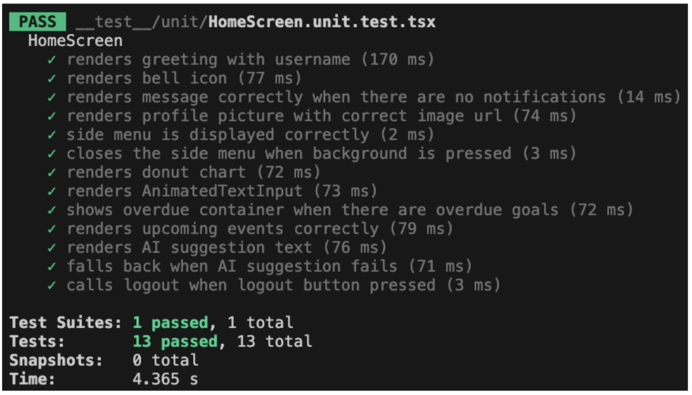
    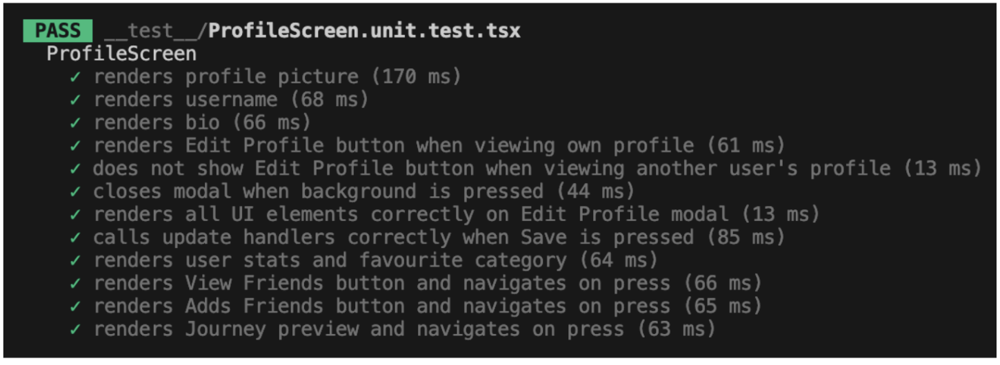
    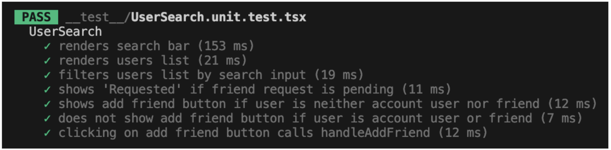
    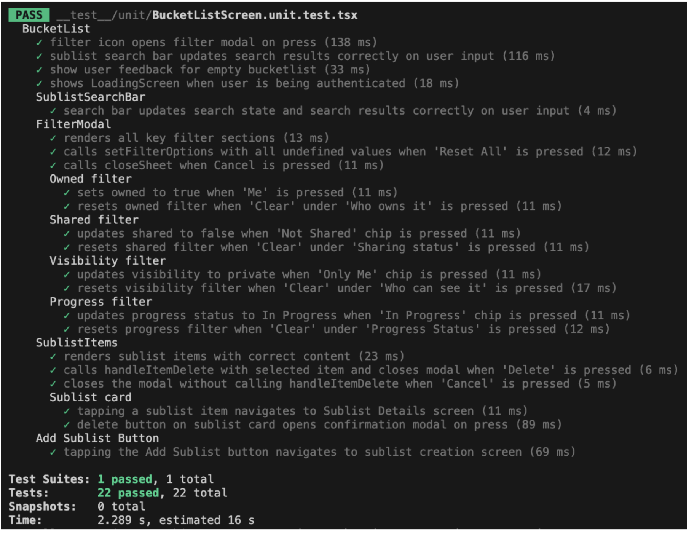
    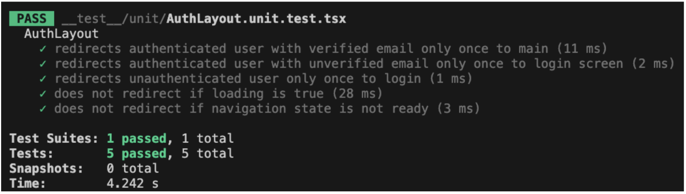
    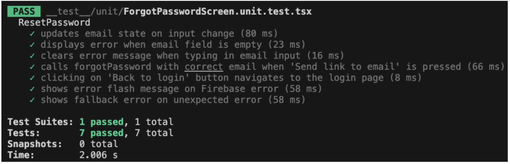
    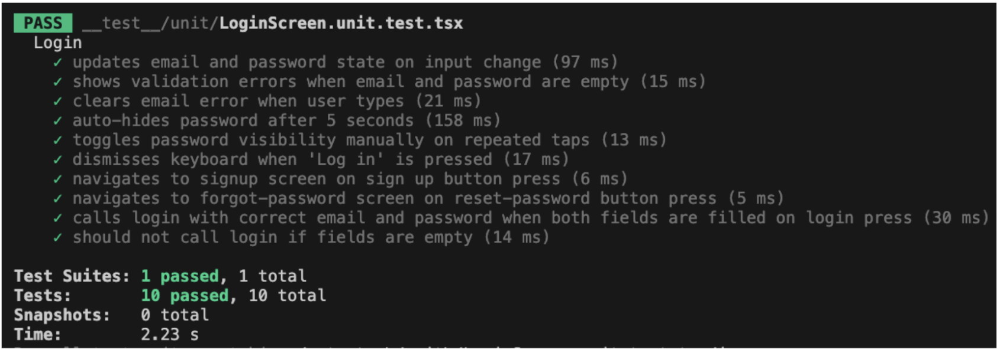
    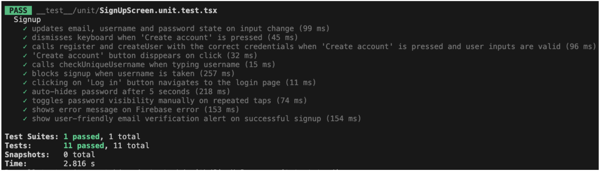

****

****

#### **User Testing**

To assess product usability and the degree to which NextUp fulfills the needs and demands of our target audience, user testing was conducted with 12 individuals from the project’s target group. The tests were conducted in the following order with related tasks done consecutively:

|                                                                                                                                                                                            |                                                                                   |                                                                                                                                                                                                                                                         |                                                                                                                                                                                                                                                                                                                                                                                                              |                                                                                                                                                                                                                                                                                                                                                                                                   |                                                                                                                                                                                                                                                                                                                     |
| ------------------------------------------------------------------------------------------------------------------------------------------------------------------------------------------ | --------------------------------------------------------------------------------- | ------------------------------------------------------------------------------------------------------------------------------------------------------------------------------------------------------------------------------------------------------- | ------------------------------------------------------------------------------------------------------------------------------------------------------------------------------------------------------------------------------------------------------------------------------------------------------------------------------------------------------------------------------------------------------------ | ------------------------------------------------------------------------------------------------------------------------------------------------------------------------------------------------------------------------------------------------------------------------------------------------------------------------------------------------------------------------------------------------- | ------------------------------------------------------------------------------------------------------------------------------------------------------------------------------------------------------------------------------------------------------------------------------------------------------------------- |
| **Test Objective**                                                                                                                                                                         | **Task**                                                                          | **Expected Actions**                                                                                                                                                                                                                                    | **Observations on user actions**                                                                                                                                                                                                                                                                                                                                                                             | **App Feedback**                                                                                                                                                                                                                                                                                                                                                                                  | **Remarks**                                                                                                                                                                                                                                                                                                         |
| To evaluate whether users can successfully create an account, including entering valid information, understanding required fields, and receiving appropriate feedback on success or error. | Create account                                                                    | 1) Navigate to the sign up page.2) Enter email, username and password.3) Click create account.                                                                                                                                                          | All users were able to create an account successfully and adjust accordingly if any of the requirements were not met.A number of users did not meet the password requirements on the first try.                                                                                                                                                                                                              | Tester was redirected to the sign up page after clicking ‘sign up’ on the login page. Feedback was given for username availability. Feedback was given when any of the three input fields did not meet the requirements after ‘create account’ was pressed.Tester was redirected to the login page and feedback was given to verify email on successful account creation.Buttons were responsive. | UI feedback helps guide users in creating an account successfully.Password requirements can be stated on the screen instead of displaying them only after the user has pressed ‘create account’ when the password requirements have not been met. This could have prevented the hassle of keying in a new password. |
| To evaluate whether users can easily notice and access notifications, and take appropriate actions.                                                                                        | Read and respond to friend requests and sublist notifications                     | 1) Navigate to the home screen.2) Click on the notification bell.3) Select accept/reject for friend request and dismiss added to sublist notification.                                                                                                  | All users were able to find and click the notification bell immediately.Users knew to click either accept or reject for friend requests and click the ‘x’ icon to dismiss notifications.                                                                                                                                                                                                                     | Notifications modal opened after the notification bell was pressed. Clicking accept or reject / the ‘x’ icon dismisses the notification. Buttons were responsive.                                                                                                                                                                                                                                 | The notification bell is well-placed and the icons are intuitive and self-explanatory.Perhaps a button could be added to dismiss all notifications at once to prevent the hassle of clicking on the ‘x’ icon of each notification.                                                                                  |
| To evaluate how intuitively users can create a shared sublist.                                                                                                                             | Create a shared sublist                                                           | 1) Navigate to the bucket list screen.2) Click on the ‘+’ button.3) Enter sublist title and select viewing status.4) Click on the add collaborators icon.5) Search for a user.6) Click on the user then press the close button.7) Click create sublist. | All users correctly navigated to the bucket list screen, pressed the ‘+’ button and filled in the details. Users were also able to invite collaborators and create a sublist successfully.                                                                                                                                                                                                                   | Clicking on the ‘+’ button redirected the user to the sublist creation page.Clicking on the add collaborators button opened the share list modal. Buttons were responsive.                                                                                                                                                                                                                        | Icons are intuitive and self-explanatory and the field titles are clear._This test focuses on shared sublist creation. Since privately owned sublist creation is simpler and follows the same base workflow, it is excluded from this test to prioritize collaborative use cases._                                  |
| To evaluate whether users can successfully update a sublist and if the process is intuitive.                                                                                               | Update sublist                                                                    | 1) Navigate to the bucket list screen and click on the sublist.2) Click on the pencil icon.3) Edit sublist details.4) Click save.                                                                                                                       | All users knew to click on the pencil icon and could update the sublist successfully.                                                                                                                                                                                                                                                                                                                        | Clicking on the pencil icon revealed input containers with the current title and description, as well as the ‘cancel’ and ‘save’ buttons. The sublist details page was updated with new changes after pressing ‘save’.Buttons were responsive.                                                                                                                                                    | The UI and self-explanatory pencil icon make the process straightforward._Editing goals and sublists share the same behavior; only one was tested to reduce duplication._                                                                                                                                           |
| To verify whether users can delete a sublist easily.                                                                                                                                       | Delete sublist                                                                    | 1) Navigate to the bucket list screen.2) Swipe the sublist to the left and click on the trash icon.3) Click confirm.                                                                                                                                    | Most users were able to delete a sublist successfully although the process was not necessarily straightforward for them. Some users navigated to the sublist details page, while some tried to long-press the sublist on the bucket list screen.                                                                                                                                                             | Swiping of the sublist was smooth. Clicking the trash icon resulted in a confirmation alert.Clicking delete removes the sublist from the bucket list screen.Buttons were responsive.                                                                                                                                                                                                              | Perhaps another trash icon could be added to the sublist details page for easier deletion of a sublist._Deleting goals and sublists share the same UI and behavior; only one was tested to reduce duplication._                                                                                                     |
| To evaluate whether users can successfully create a goal, and if the process is intuitive.                                                                                                 | Create goal with category specified and deadline set                              | 1) Navigate to the bucket list screen.2) Click on the sublist.3) Click on the add goal button.4) Enter the title and select up to 3 categories.5) Set a deadline with the date-time picker.6) Click save.                                               | All users correctly navigated to the sublist details page and successfully added a goal.                                                                                                                                                                                                                                                                                                                     | Clicking on the add goal button opens the create goal modal. Feedback was given for successful creation of a goal after ‘save’ was pressed.Buttons were responsive. Scrolling of the date-time picker was smooth.                                                                                                                                                                                 | Placeholders are clear in guiding users to fill in goal details. The goal creation process is intuitive.                                                                                                                                                                                                            |
| To evaluate whether users can successfully create a post and if the process is intuitive.                                                                                                  | Create post for goal (include photo uploading and entering of description)        | 1) Navigate to the bucket list screen.2) Click on the sublist.3) Click on the goal.4) Click add post.5) Upload up to 5 photos.6) Enter description.7) Click save.                                                                                       | All users could successfully create a post.                                                                                                                                                                                                                                                                                                                                                                  | Clicking ‘add post’ replaced it with the ‘add photos’ button, description input and the ‘cancel’ and post buttons.Clicking ‘add photos’ opened a modal of the user’s gallery. Clicking ‘post’ displayed the post with the words ‘sending…’ before the post details were shown.Buttons were responsive.                                                                                            | UI is intuitive and displaying a loading state before the post details are rendered provides clear feedback to users.                                                                                                                                                                                               |
| To check if users can clearly identify how to mark an event as complete.                                                                                                                   | Toggle goal completion                                                            | 1) Navigate to the bucket list screen.2) Click on the sublist.3) Click on the goal.4) Click on the toggle element.                                                                                                                                      | All users correctly navigated to the goal page and clicked on the toggle element.                                                                                                                                                                                                                                                                                                                            | Toggling was smooth and responsive.                                                                                                                                                                                                                                                                                                                                                               | UI is intuitive.                                                                                                                                                                                                                                                                                                    |
| To evaluate whether users can successfully update their profile and if the process is intuitive.                                                                                           | Update profile (include selecting profile pic, adding bio and selecting category) | 1) Navigate to the profile screen.2) Click on edit profile.3) Click on profile pic icon and select an image.4) Enter bio.5) Select a category using the category picker.6) Click save.                                                                  | Users correctly navigated to the profile page and pressed the ‘edit profile’ button to update their profile.Some users did not know they had to unselect the current selection to select another category initially.As the app may require some time for fetching and sending of data after pressing ‘save’, some users clicked the ‘save’ button more than once as they thought the app was not responding. | Clicking edit profile opened the edit profile modal. Feedback was given for successful update of profile after ‘save’ was pressed. After clicking ‘save’, there was a delay before feedback was shown.                                                                                                                                                                                            | A loading state could be shown before the profile details are updated to prevent users repeatedly clicking the ‘save’ button.                                                                                                                                                                                       |
| To assess whether users can add a friend easily.                                                                                                                                           | Add friend                                                                        | 1) Navigate to the profile screen.2) Click on add friends icon.3) Search for users.4) Click add friend icon next to user.                                                                                                                               | All users were able  to navigate to the add friends page and successfully sent a friend request.                                                                                                                                                                                                                                                                                                             | Clicking on the add friends button redirected the user to the add friends page. Feedback was given for successful sending of a friend request after clicking on the add friend icon.Buttons were responsive.                                                                                                                                                                                      | UI is intuitive.                                                                                                                                                                                                                                                                                                    |
| To evaluate whether users can easily remove a friend.                                                                                                                                      | Remove friend                                                                     | 1) Navigate to the profile screen.2) Click on view friends / add friends icon.3) Search for a user.4) Click on the user.5) Click remove friend icon.                                                                                                    | All users navigated to the friends page, clicked on a user and successfully removed the user from their friends list.                                                                                                                                                                                                                                                                                        | Clicking on a user redirected the tester to the user’s profile page.Clicking on the remove friend button triggered a confirmation alert. Buttons were responsive.                                                                                                                                                                                                                                 | The remove friend icon clearly represents the button’s functionality and the confirmation alert not only prevents accidental removals, but also communicates the purpose of the button through the confirmation message.                                                                                            |

### **Timeline and Development Plan**

| MS | Tasks | Description | In Charge | Date |
|---|---|---|---|---|
| 1 | Finalise Ideas | Discuss project structure, features and tech stack | Gracia, Tricia | 12 May |
| | Set up project structure | Set up project structure and clean up newly created Expo app | Tricia | 12 May |
| | Draft wireframes | Draft wireframes and designed UI/UX for Home, Journey Bucket List Sublist, Completed Event, Event Update, and Profile screens using Figma | Gracia, Tricia | 12 May |
| 13 | Learning and Research | Pick up technical knowledge on React Native (Expo), Firebase and Github | Gracia, Tricia | 12 May - 17 May |
| | User account authentication and main login screens | Set up Firebase and implement user authentication for email and password | Tricia | 12 May - 21 May |
| | | Implement sign-up/login/forgot-password screen UI | Gracia | 21 May |
| | | Integrate processes with firebase backend | | 23 May - 25 May |
| 27 | | Implement home page UI with logout | Tricia | 23 May |
| | | Implement bucket list page UI | Gracia | 16 May |
| | | Implement journey page UI | Tricia | |
| | | Implement profile page UI | Tricia | |
| | | Implement new-sublist page UI | Gracia | 29 May |
| | | Connect project to Cloud Firestore | Tricia | 25 May |
| | Evaluation Milestone 1 | Ideation, Proof-of-concept | | 2 June |
| 2 | Social feature: adding friends | Implement UI of friends and add friends page | Tricia | 30 May - 31 May |
| | Profile screen enhancement | Implement UI for edit profile modal | Tricia | 15 June - 24 June |
| | Screens integration with database | Display dynamic user data for home, bucketlist, journey, profile, friends and add friends screens | Gracia, Tricia | |
| | Create bucket list feature | Bucket list (sublist) creation page with: Add title, Set access status (private/shared/public), Invite friends to collaborate/edit sublist, Add/delete events from sublist, Add tags to categorise, Ensure user data can be written to and retrieved from Cloud Firestore | Gracia | |
| | Express JS backend | Set up Firebase Admin and Cloudinary | Gracia, Tricia | 16 June - 22 June |
| | Testing and debugging | Refine UI/UX, review CRUD operations, test code for bugs, resolve known issues | Gracia, Tricia | 24 June - 28 June |
| | Evaluation Milestone 2 | Implement system prototype containing the most essential features, Perform system testing | Tricia | 30 June |
| 3 | Social feature: Enhancing add friends | Sending an invite, Friends can accept or reject invites, Friends added can be removed | Tricia | 1 July - 3 July |
| | Notifications | Displaying notifications for friend requests and invitations to sub-bucket lists | Tricia | 1 July - 4 July |
| | Customisation feature | Upload profile picture | Tricia | 5 July - 6 July |
| | AI suggestion feature | Gemini API integration, suggestions UI | Gracia | 1 July - 3 July |
| | Adding reflections and event journaling | Event journaling feature set up | | |
| | Inviting collaborators for shared sublists | Add and integrate Firestore sublist sharing logic and REST api: Invite collaborators, Create/fetch/update shared sublists as collaborators, Create/fetch/update/delete goals as collaborators | Gracia | 1 July - 4 July |
| | Filter feature | Search filter set up | Gracia | 4 July - 6 July |
| | Testing and debugging | Refine UI/UX, test and review code, user testing and feedback | Gracia, Tricia | 9 July - 18 July |
| | Project work by 28 July | Milestone 3 (Extensions) - Extend system by adding more useful features, Perform system/user testing | | 28 July |
| 4 | Refinement | Continuously monitor AI integration performance and address any issues; conduct other necessary feature improvements | Gracia, Tricia | 29 July - 14 August |
| | Optimisation | Work on performance optimisation, e.g. optimize database reads/writes to reduce load time and Firestore costs, etc. | | |
| | Testing and debugging | Test and review code, user testing and feedback, review and finalise UI/UX | | |
| | Project work by 14 August | Final Submission (Refinement) - Polish up system and fix outstanding issues | | 14 August |

### **Technical Proof-of-Concept**

Open this link on your Android devices (or scan the QR code) to install the app:

<https://expo.dev/accounts/gracias022/projects/nextup/builds/d4fd32ef-8c29-484c-89d0-a8fbda45a27a> 

**You may use the following sign-in credentials:**

Email: purplepiess03\@gmail.com

Password: Purple123!

### **Project Log**

Google sheets: [https://docs.google.com/spreadsheets/d/1c6MvHHeD54IcdIBhyTbzKOeJJeQ693PvFEcSDsSKT9Y/](https://docs.google.com/spreadsheets/d/1c6MvHHeD54IcdIBhyTbzKOeJJeQ693PvFEcSDsSKT9Y/edit?usp=drivesdk)

### **Poster:** 

[7356.png](https://drive.google.com/file/d/10_MZdk9X0PZvcw7PbhrmChKFkqCDVmXF/view?usp=sharing) 

### **Video:** 

[7356.mp4](https://drive.google.com/file/d/1DPV_FamrpB6vJgNPM2blNQnpV7DutHq2/view?usp=sharing)

**References**

- <https://medium.com/@ppmkgaikwad/basic-api-test-case-implementation-using-insomnia-cd61284e20ae> 

- <https://blog.pixelfreestudio.com/best-practices-for-real-time-data-synchronization-across-devices/> 

- <https://medium.com/@andrew.chester/react-native-infinite-scrolling-with-lazy-loading-a-step-by-step-guide-e91647348689> 

- <https://zustand.docs.pmnd.rs/getting-started/introduction> 

- <https://medium.com/@talhatlc/firestore-batches-vs-transactions-when-and-how-to-use-them-49a83e8a7c42> 
